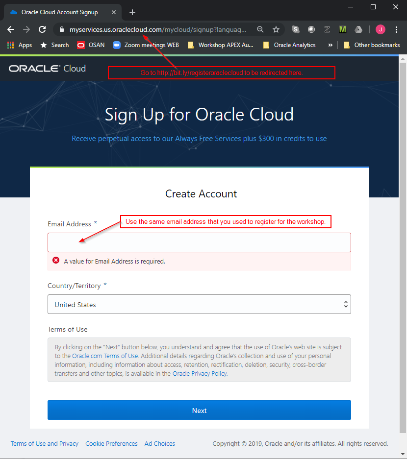
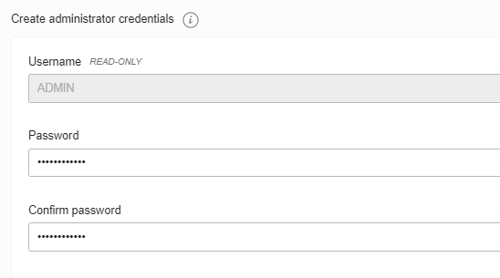
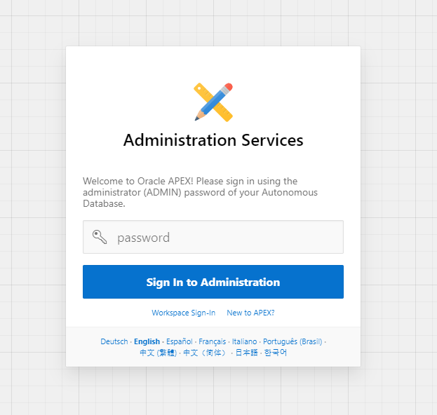
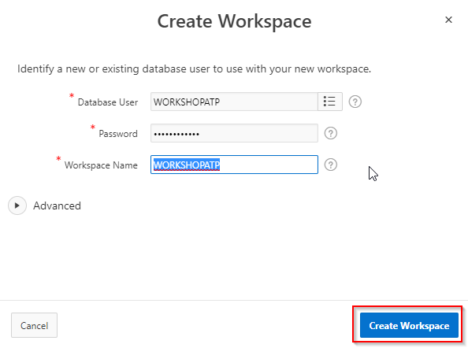

# Lab 100: Introduction and provisioning

# Step 1: Request your Oracle Trial account

- Complete the Oracle Cloud Trial wizard here: [http://bit.ly/registeroraclecloud](http://bit.ly/registeroraclecloud). To prevent being asked for a credit card, it's important to use __this exact URL__.
- It's also important to __use the same email address that you used to register for the workshop__.

-
- On the next page you will be asked for the Cloud Account Name. This is what will uniquely identify your cloud environment. You will see it as part of the URL when you access it later.
- You will also be asked for the "Home Region". This is the location of the physical data center. Choose you nearest location.

-
- At the end of this process, you should receive an email titled "Get Started Now With Oracle Cloud".
- To login to your cloud account, use the same email address that you used for registration.
- If you have to choose your identify domain, this is the same as the value that you chose for "Cloud Account Name" during registration.
  

# Step 2: Provision an Autonomous Transaction Processing database

  - On the left hand menu, choose Autonomous Transaction Processing.

  

  - Choose to create a new instance.
  
  

  - Choose any name for the database, in this case "WORKSHOP".
  
  

  - Choose the Transaction Processing option. This will optimize the database for daily transactional processing. 
  
  
  
  - Choose the Serverless deployment type.
  
  

  - The Always Free option will allow you to keep using the ATP instance, even after the trial ends. However, the Always Free option might not perform as well as a non-Always Free instance. 
If you have just created an Oracle Trial you will have a certain amount of cloud credits that you can spend as you wish. We recommend **-not-** to select Always Free if you have just created your Oracle Trial, so that performance of the instance is guaranteed.

  

  - Set the admin password. *Make a note of this as you will need it.*

  

  - Create the database. 

  
  
  This typically completes within about 5 minutes and you will see the status "AVAILABLE".

# Step 3: Prepare the APEX workspace

  - Go to the details of the autonomous database and open the Service Console.

  
  
  - Go to Development and open APEX.
  
  
  
  -  You will see the login page fof APEX Administration Services. Use the ADMIN password that you entered when you provisioned ATP.

  

  - Follow the instructions to create a new workspace.
  
  

  - In this case let's call the workspace and database user "WORKSHOPATP".
    Keep a note of the password as you will need it later.

  
  
