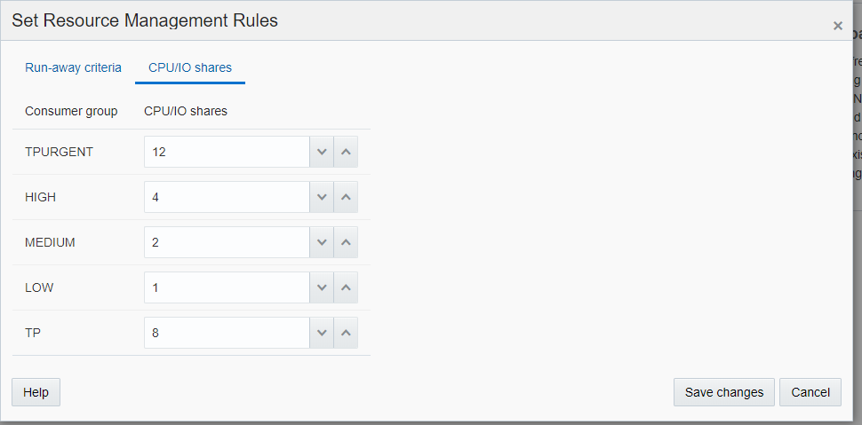
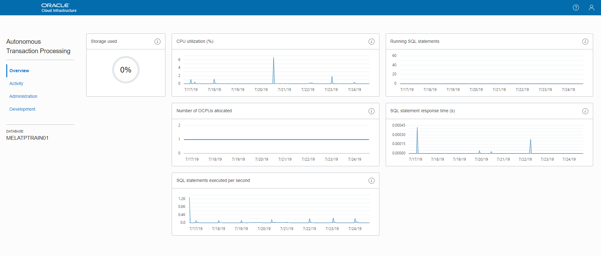
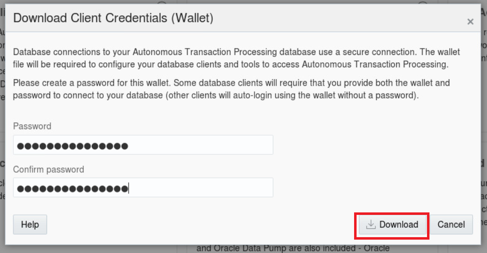
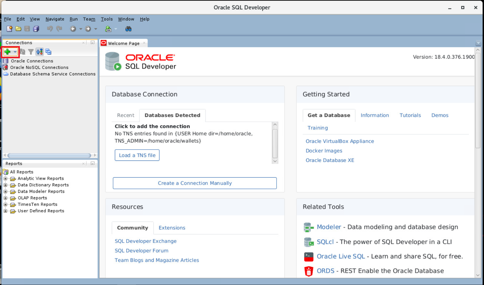
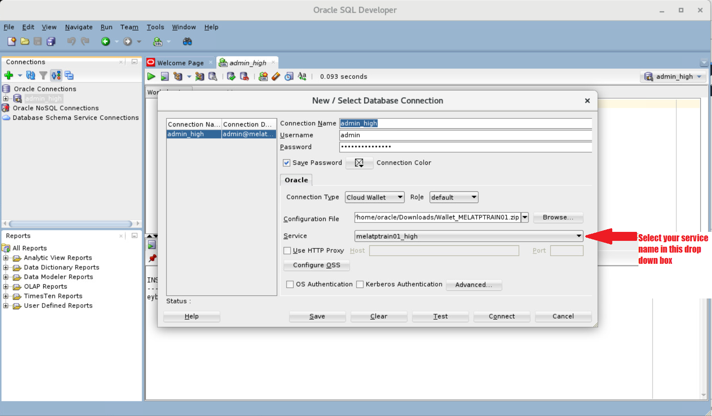
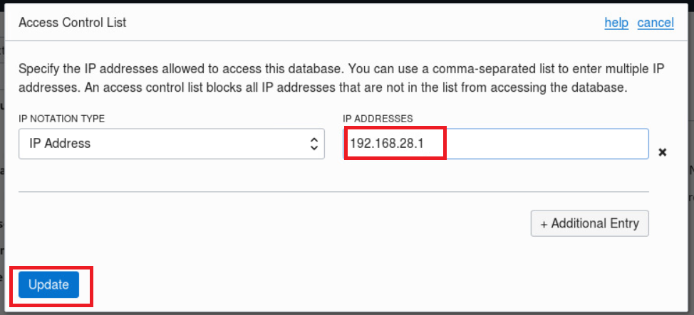
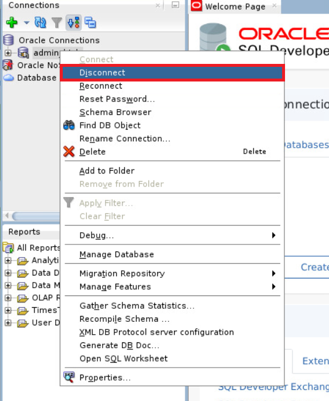
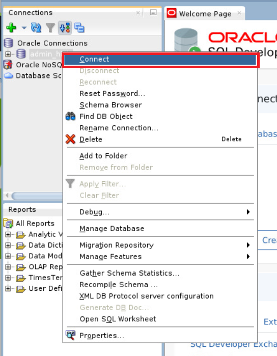

# Part 2. Securely Connecting to Autonomous Transaction Processing

**Objectives:**

•                 Learn about the different Consumer Groups in Autonomous Transaction Processing (ATP)

•                 Learn how to download the credential wallet for your ATP instance

•                 Learn how to securely connect desktop tools to ATP

 

Applications and tools connect to ATP databases by using Oracle Net Services (also known as SQL*Net). SQL*Net supports a variety of connection types to ATP databases, including Oracle Call Interface (OCI), ODBC drivers, JDBC OC, and JDBC Thin Driver. Unlike other cloud services you do not get a UNIX command line interface on the system hosting your ATP instance, this reduces the complexity and need of UNIX skills required to administer it.  

 

The sample SQL scripts for this lab are available in your VM under the directory **/home/oracle/labScripts/lab2**.

 

## Managing Priorities on Autonomous Transaction Processing

The priority of user requests in ATP is determined by the database service the user is connected to. Users are required to select a service when connecting to the database. The service names are in the format:

•                 *database_name*_tpurgent

•                 *database_name*_tp 

•                 *database_name*_low 

•                 *database_name*_medium 

•                 *database_name*_high 

 

These services map to the LOW, MEDIUM, HIGH, TP and TPURGENT consumer groups.  For example, a user connecting to database_name_low service uses the consumer group LOW.  

 

The basic characteristics of these consumer groups are:

 

- **tpurgent**: The highest priority application connection service      for time critical transaction processing operations. This connection      service supports manual parallelism.

 

- **tp**: A typical application connection service for transaction      processing operations. Queries run serially.

 

- **high**: A high priority application connection service for      reporting and batch operations with low concurrency requirements. All      operations run in parallel  (if you      have multiple OCPU assigned to your instance) and are subject to queuing.

 

- **medium**: A typical application connection service for reporting      and batch operations. All operations run in parallel and are subject to      queuing.

 

- **low**: A lowest priority application connection service for high      concurrency reporting or batch processing operations. Queries run serially.

 

By default, the CPU/IO shares assigned to the consumer groups TPURGENT, TP, HIGH, MEDIUM, and LOW are 12, 8, 4, 2, and 1, respectively. The shares determine how much CPU/IO resources a consumer group can use with respect to the other consumer groups. With the default settings the consumer group TPURGENT will be able to use 12 times more CPU/IO resources compared to LOW, when needed. The consumer group TP will be able to use 4 times more CPU/IO resources compared to MEDIUM, when needed.

To change the default values for the shares you can use the PL/SQL procedure `cs_resource_manager.update_plan_directive` or via the Service Console for your instance.  

 

As a database administrator and an application developer you need to select the database service based on your performance, concurrency and parallelism requirements.

## Downloading the credentials wallet

As ATP only accepts secure connections to the database, you need to download the wallet file containing your credentials first. 

 

The wallet is downloaded from the ATP service console, or from the "**DB Connection**" button on the instance details page. To access the ATP Service console, find your database on the table listing ATP instances and click on the three vertical dots on the right-hand side.

 In the pop-up menu select **Service Console.**

 

​                                                  

This will open a new browser tab for the Service Console. 

If you are prompted to do so, sign in to the service console with the following information.

 

**Username:** admin

**Password:** The administrator password you specified during provisioning

 

   

 

You will now see the main **dashboard** page for your instance.  As we have not generated any load into the instance, it may have ‘No data to display’ in the information panes. Other workshops can explore the **Overview** and **Activity** tabs in more detail.

 

   

 

Click the “**Administration**” link in the left-hand side menu and click “**Download Client Credentials**” to download the wallet. 

 

   

 

Specify a password for the wallet. Some applications require this password when connecting to the database, for example some JDBC thin applications will require this password to use as the keystore password. Note that this password is separate from the admin password and can be set to a different value. For this lab, you could use the value ATPwelcome-1234 or another memorable password of your choice.

 

Click Download to download the wallet file to your lab virtual machine.

 

   

Select to Save the file, and then click ok. This will save the file in the default downloads location $HOME/Downloads

 

 

   

 

## Connecting to the database using SQL Developer

Minimise your Firefox window, and on your Lab VM desktop, start SQL Developer by double clicking on the icon.

 

​    

 

Click the Create Connection icon in the Connections toolbox on the top left of the SQL Developer homepage.

 

   

 

This will open the **New/Select Database Connection Screen**.  See below the screenshot for information on how to complete this form.

   

 

**Connection Name:** admin_high 

**Username:** admin

**Password:** The admin password you specified during the provisioning process.

**Connection Type:** Cloud Wallet

**Configuration File:** Enter the full path for the wallet file you downloaded earlier in the lab or click the Browse button to point to the locate the file (by default it will be under your Downloads directory).

**Service:** The Wallet will contain the service names for all the ATP databases in the tenancy so this list could be long. Please make sure that you are selecting your database.  As discussed previously there are 5 pre-configured database services for each database. Pick *<your databasename>_high* for this lab. For example, if you created a database named **melatptrain01** select **melatptrain01_high** as the service.

 

Test your connection by clicking the Test button, if it succeeds save your connection information by clicking Save, then connect to your database by clicking the Connect button.

 

You can now run a test query using the sample data in the SH schema.

 

In the SQL Worksheet enter the following SQL:

 

`select country_region, count(country_name) from sh.countries group by country_region;`

and press the ‘Run Script’ button or press F5. 

   

 

*Note – You do not have to use GUI tools to access an ATP instance. Other Oracle Client utilities such as SQL Plus can connect to the ATP instance using a wallet.*

## (Optional) Secure access to your Autonomous Database using Access Control Lists

An Access Control List (ACL) provides additional protection for your Autonomous Database by allowing only the IP addresses in the list to connect to the database.

 

When you provision a new Autonomous Database, it does not have an initial ACL. You can use the Oracle Cloud Infrastructure Console, API, or CLI to create an ACL for the database by adding a minimum of one entry to the list. An entry can be a comma-separated list of CIDR blocks or public IP addresses. You can modify the list at any time. Setting the ACL for the Autonomous Database does not block administration activities via the Service Console or the Oracle Cloud Infrastructure Console. Removing all entries from the list makes the database accessible to all clients with the applicable credentials.

 

In this exercise you will:

·       Create an ACL that will block your access to your Autonomous Database.

·       Alter this ACL to only allow your lab VM access to your Autonomous Database.

It is important to complete this exercise successfully to allow subsequent labs to complete.

 

 

#### Creating your initial ACL

 

Navigate back to the **Autonomous Transaction Processing** page in the lab compartment.

 

Click on the name of your database to open the instance details screen.

 

   

 

In the **Actions** drop down select **"Access Control List"**

 

In the pop up box enter the IP Address **192.168.28.1** and select **"Update".** This is a non-routable IP address that is not in use in the lab environment. Once you set an ACL only new connections from IP addresses that match the ACL will be allowed to connect.

 

   

 

The Lifecycle status will change to **"Updating".**

 

​    

Wait until the Lifecycle status is **"Available"**

 

   

 

Return to your SQL Developer window. Select your **"admin_high"** connection, right click to bring up the menu and select "**Disconnect".** 

 

   

 

Connect to your database again. Select your **"admin_high"** connection, right click to bring up the menu and select "**Connect".** 

 

   

 

 

 

The connection to the database should fail with **"IO Error: Undefined Error"**

 

   

 

*Note – If your connection to the database succeeds, this usually means that there is a problem with the definition of your admin_high connection and the 'Service Name' was not set to your database.*

 

#### Correcting the ACL to allow connections

 

To ensure Return to your Firefox browser and navigate back to the **Autonomous Transaction Processing** page in the lab compartment.

 

Click on the name of your database to open the instance details screen.

 

   

In the **Actions** drop down select **"Access Control List"**

 

   

 

In the pop up box use the small x next to the IP address to delete the existing entry.

   

 

Select the **"Additional Entry"** button to create a new ACL entry.

 

   

Enter the IP Address of your Lab Virtual Machine. This is the address you used to connect using the VNC viewer, without the ':1' on the end.  Each Virtual Machine has its own IP address.

 

For example: if your VNC connection was to 192.0.2.1:1 the IP address you enter will be 192.0.2.1.

 

   

 

Select **"Update".** 

 

The Lifecycle status will change to **"Updating".**

 

​    

Wait until the Lifecycle status is **"Available"**

 

   

 

Return to your SQL Developer window.  Connect to your database again. Select your **"admin_high"** connection, right click to bring up the menu and select "**Connect".** 

 

   

 

The connection should succeed. Test this by running a simple SQL query in SQL Worksheet.

 

In the SQL Worksheet enter the following SQL:

 

`select country_region, count(country_name) from sh.countries group by country_region;`

 

and press the ‘Run Script’ button or press F5. 

   

*Note – If your connection to the database still fails, verify that the IP address that you have specified for your ACL is correct.*

 

#### Remove all the ACL entries

 

Return to your Firefox browser and navigate back to the **Autonomous Transaction Processing** page in the lab compartment.

 

Click on the name of your database to open the instance details screen.

 

   

 

In the **Actions** drop down select **"Access Control List"**

 

   

 

In the pop up box use the small x next to the IP address to delete the existing entry.

   

The pop-up will now have no IP Addresses or CIDR blocks specified.  Select "Update" to save this change.

The Lifecycle status will change to **"Updating".**

 

​    

Wait until the Lifecycle status is **"Available"**

 

   

 

 

Once you have successfully removed all the ACL entries you have completed Part 2. [Return to the Lab Introduction Page](readme.md)

 

 

 

 

 

 

 

 