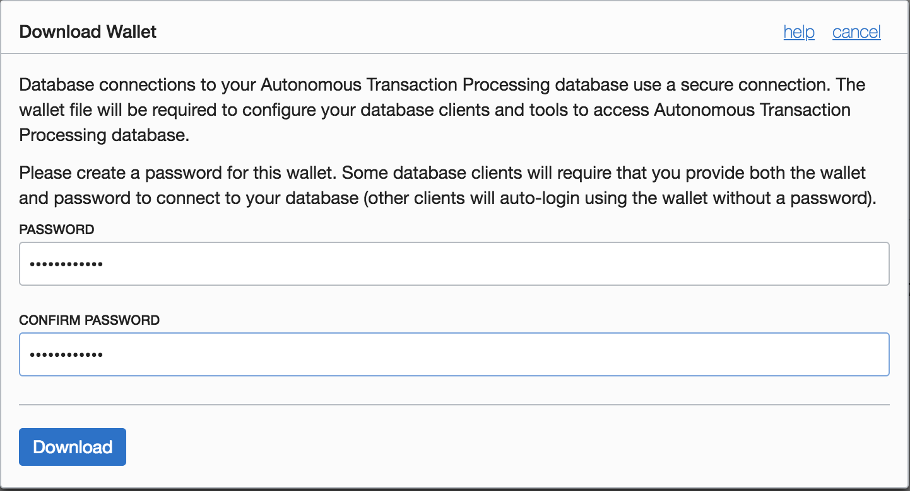
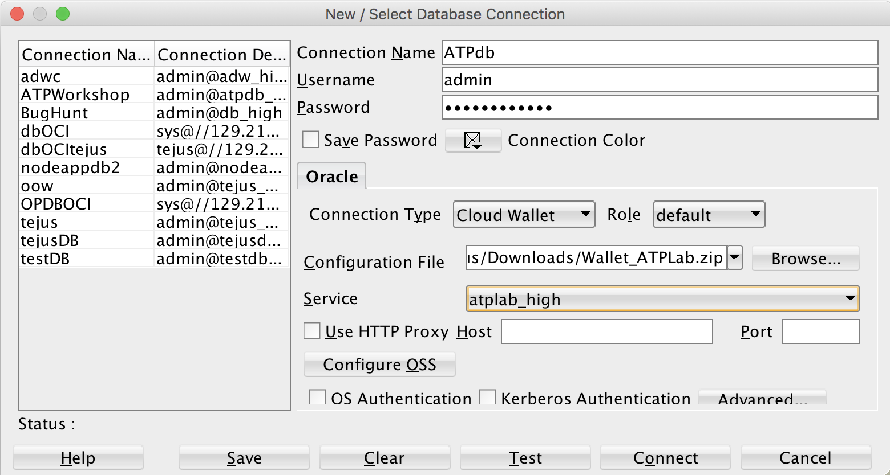
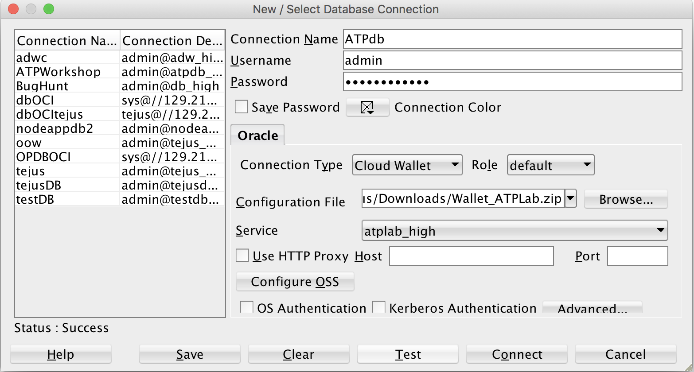
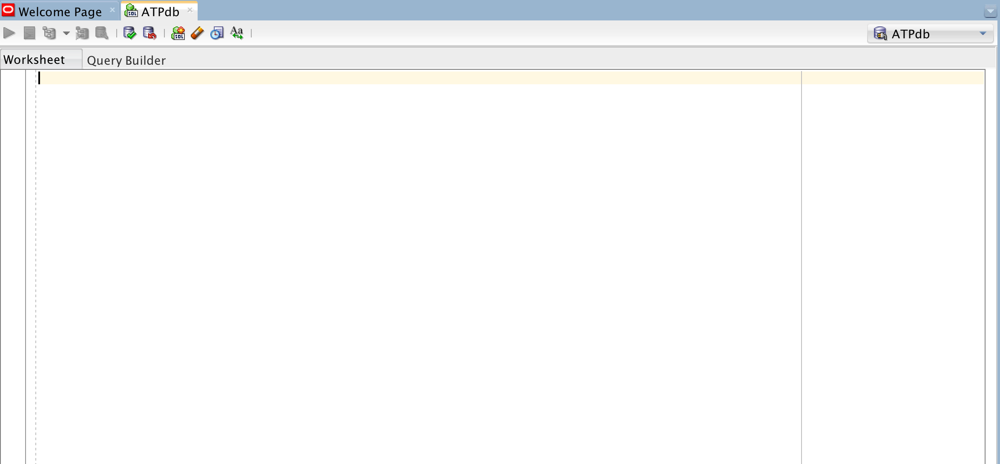

[Go to Overview Page](README.md)


# Microservices on ATP

## Part 2: Secure Connectivity and Data Access
#### **Introduction**

In this lab we will configure a secure connection using Oracle SQL Developer.

#### **Objectives**

- Learn how to configure a secure connection using Oracle SQL Developer

#### **Required Artifacts**

- You should have Oracle SQL Developer installed on your machine. If not, you can download the latest version from [here](https://www.oracle.com/technetwork/developer-tools/sql-developer/downloads/index.html).


## Steps

### **STEP 1: Download the secure connection wallet for your provisioned instance**

- Log into your cloud account using your tenant name, username and password.

- Click on Menu and select Autonomous Transaction Processing

- On the ATP console, select your ATP instance provisioned in <a href="./LabGuide100ProvisionAnATPDatabase.md" target="_blank">LabGuide1.md</a>.


- Click on  **DB Connection** to open up Database Connection pop-up window


- Click on **Download** to supply a password for the wallet and download your client credentials.
#### Example password:

```
WElcome_123#
```



- Once you have downloaded your wallet, you will be navigated to ATP overview page

- The credentials zip file contains the encryption wallet, Java keystore and other relevant files to make a secure TLS 1.2 connection to your database from client applications. Store this file in a secure location.

### **STEP 2: Connect to the ATP instance with SQL Developer**

- Launch SQL Developer from the desktop and click Add Connection on top left.


Enter the following in New database connection

**Connection Name**: Name for your connection

**Username**: admin

**Password**: your ATP database password

**Connection Type**: Cloud Wallet

**Role**: Default

**Configuration File**: Click on Browse and select the wallet file you downloaded

**Service**: 'databasename_high' Database name followed by suffix low, medium or high. These suffixes determine degree of parallelism used and are relevant for a DSS workload. For OLTP workloads it's safe to select any of them. Example: **atplab_high**



- Test your connection and save. The **Status** bar will show **Success** if it is a successful connection.



Click on **Connect**. You now have a secure connection to your cloud database.



You have connected your Autonomous Transaction Processing Cloud instance to Oracle SQL Developer.

-   You are now ready to move to the next lab.


------

[Go to Overview Page](README.md)

