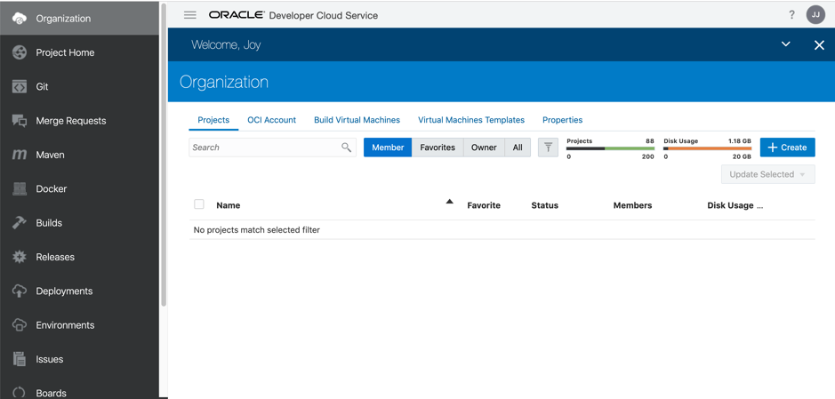
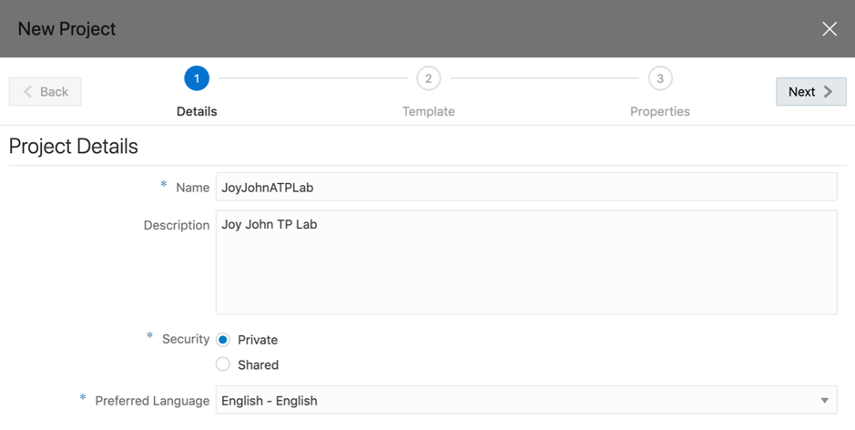
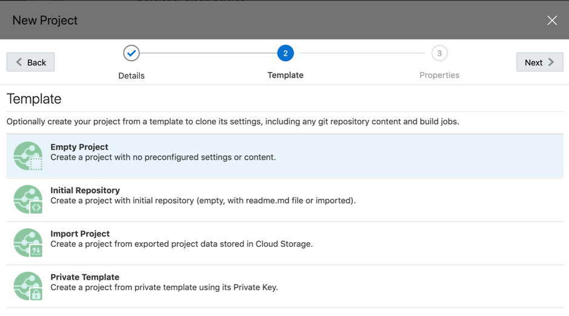
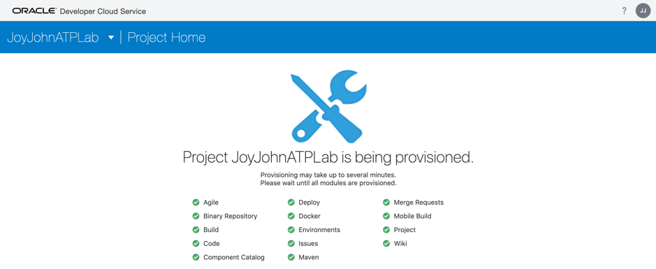
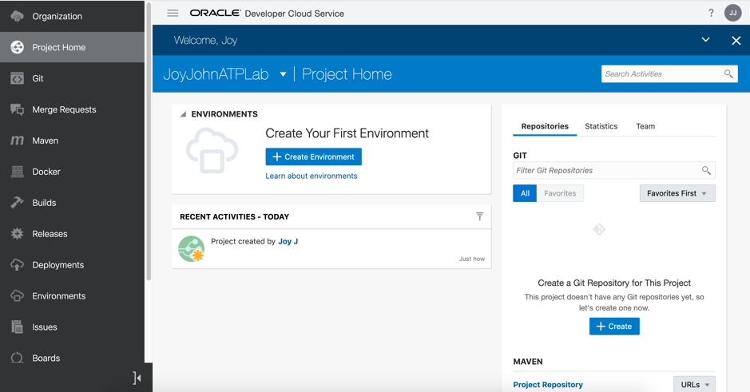
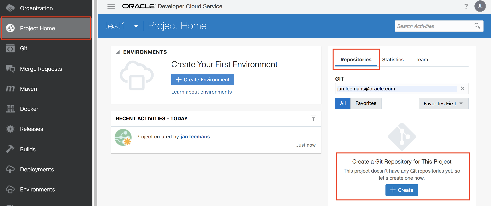
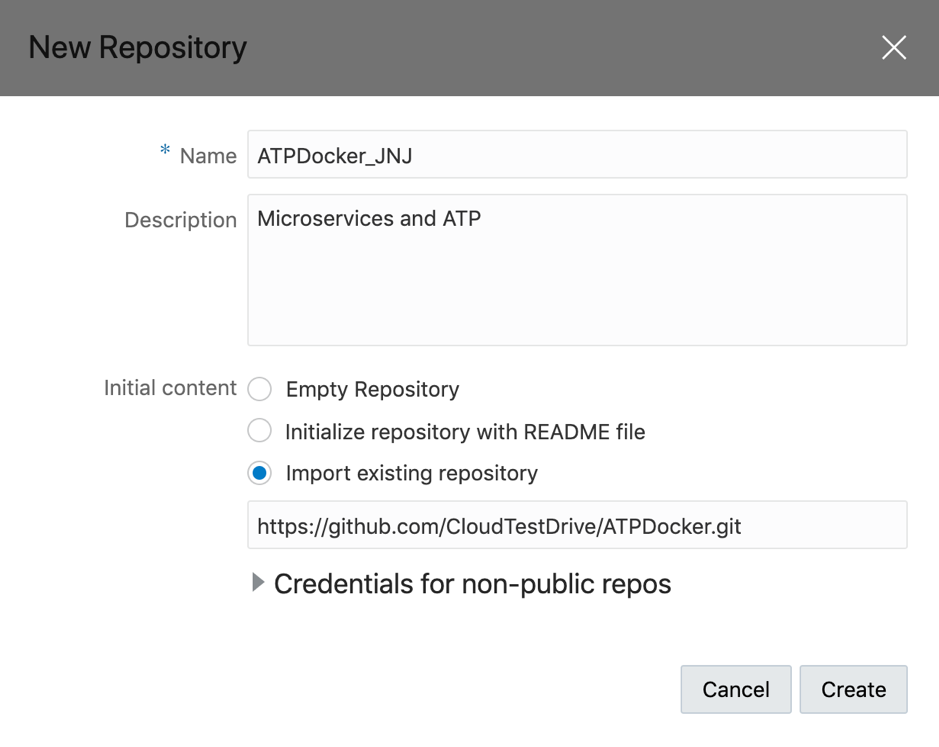
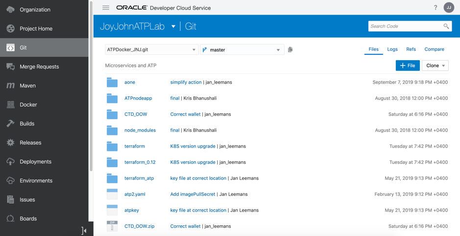

[Go to ATP Overview Page](../../ATP/readme.md)

# Microservices on ATP #

## Part 1 - Setting up your Developer Cloud Project ##

## Introduction ##

In this lab, you’ll learn how to set up a new Developer project, based on a Github repository, and start modifying and automating the CI/CD steps for your environment.

You will work with DevCS and learn about some of its most important features.  

Let’s get started! 

## Steps

### Step 1: Create a project environment for your team

In this section, you’ll provision a complete development platform for your team by leveraging DevCS’s web interface.

- Access your Developer Cloud Instance
  - <u>When using on an Oracle-provided environment</u>: On your VNC viewer, using Firefox, Navigate to the Developer Cloud Service Instance link provided by your instructor.
  - <u>When using a Personal Trial</u>: Use the URL to your Developer Cloud Console you saved during the setup of your environment 

- On the Welcome page, click **New Project**.

- Give your project a name that begins with your own name, such as **JohnDunbarATPLab**, to make your project unique.  Then: 

  - Enter a **Description**, such as **ATP Lab Project**.

  - Leave the Security setting specified as **Private**.

  - Click **Next**

    

- Click **Empty Project**, then click **Next**.

  

- Select your preferred wiki markup language, then click **Finish**

  

- Wait while the project modules are provisioned, which can take a minute or two. You can see the indicators turn green as the associated modules are provisioned.

  

- When everything is provisioned, the project Home page opens, which contains details about your newly created project:

  

  Let’s take a look at this page (you may need to scroll to see the whole thing): 
  - On the left side is an activity feed. 
  - Tabs on the right side show you where the Git source code and Maven repositories are located.
  - Also on the right you can see project statistics, as well as the UI where you can manage team members.  Let’s take a look at that UI now. 

### Step 2:  Fetch and review code from the Git repository

- With the **Project Home** selected on the left menu, look to the right and select **Repositories**, then click **+ Create** button.

  

- In the New Repository dialog, enter these details: 
  - Type **ATPDocker** in the **Name** field.  In case you are sharing a repository with other participants, add your initials at the end of the name, like for example **ATPDocker_JLE**

  - Type **Microservices and ATP** in the **Description** field

  - Choose **Import Existing Repository** under **Initial content**

  - Enter https://github.com/CloudTestDrive/ATPDocker.git in the text box: 

    

- Click **Create**.

  You should now be on the Code tab, which shows that you have a new DevCS git repository, NodeJSDocker.git.  This new repository contains imported code from the GitHub repository you specified.

  

- **Running on your personal Trial instance** ?  Then you have [one more step](LabGuide250Devcs-proj_own1.md) to perform, cloning the Developer git repository to your local environment.  

You are now ready to start configuring your CI/CD flows in this project!

- create the necessary database objects
- build your application Docker Container
- deploy the container to a Kubernetes cluster

Go back to the overview page and select the next lab step to continue.

---
[Go to ATP Overview Page](../../ATP/readme.md)

