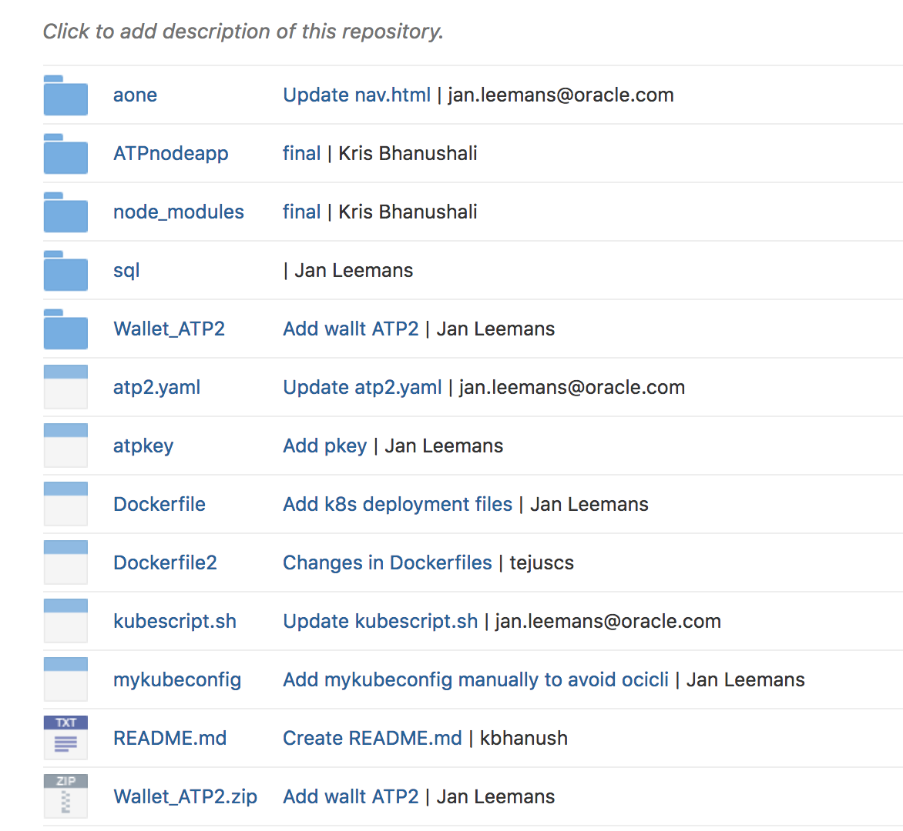
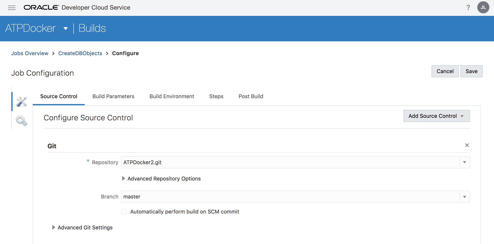
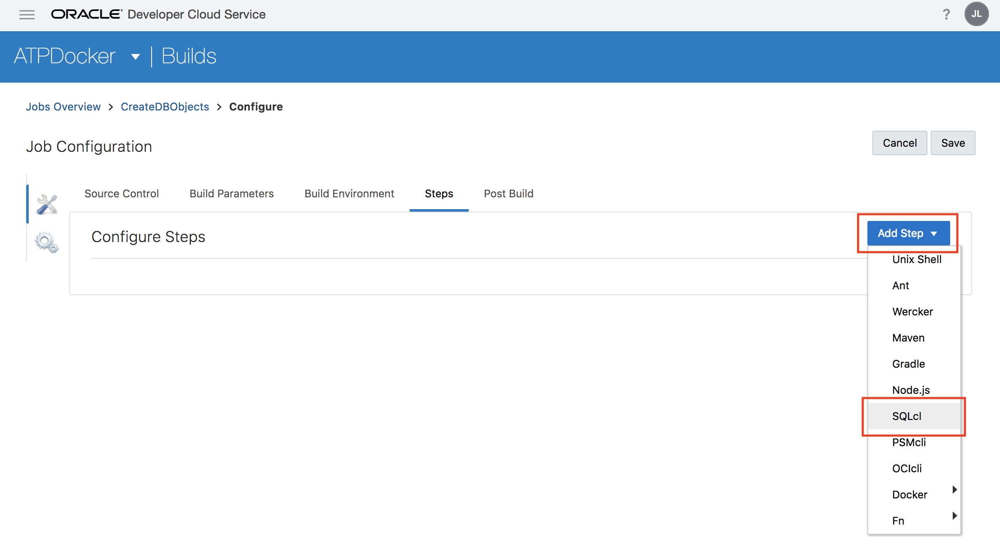
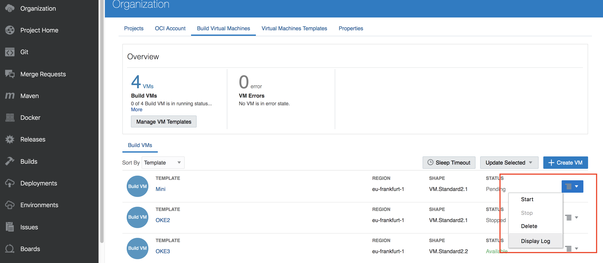
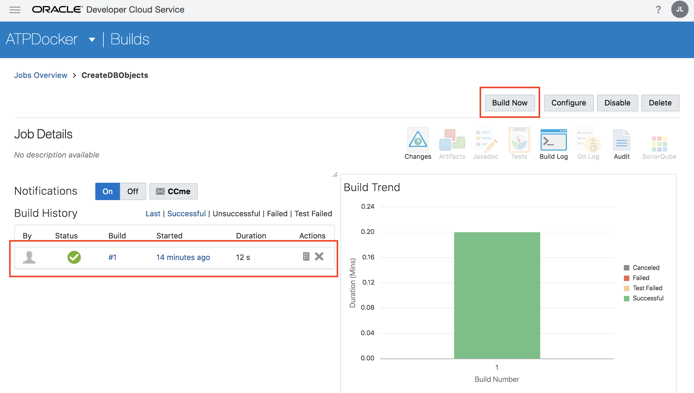
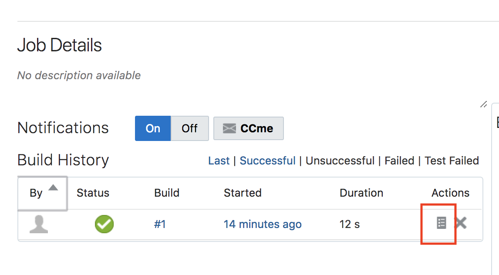

[Go to ATP Overview Page](../../ATP/readme.md)


# Microservices on ATP


## Part 2: Data Loading into ATP
#### **Introduction**

In this lab, you will be creating a few tables and inserting data into the ATP database using the CI/CD features of Developer Cloud.  We'll use the Build engine of DevCS to set up a flow that will create the necessary objects in the database, and insert data into the tables.  In case these elements are changed in the repository, the script will trigger again and re-create the database elements.

In real life, you would want to set up a more sophisticated logic to manage your database objects, see [these blogs on the topic by Shay Schmeltzer](https://blogs.oracle.com/shay/devcs).


#### **Objectives**

- Set up your ATP Wallet in Developer Cloud
- Create and run a Build to create your database objects
- Validate reation via SQLDeveloper


## Steps

### STEP 1: Set up your ATP Wallet in Developer Cloud

In the ATP Connection step of this lab, you downloaded the ATP Connection wallet zip file into the Downloads folder.  We will now unizp the file and copy both the wallet zip file and the folder into the git repository folder.

```bash
cd Downloads

# List downloaded files
ls -l

unzip Wallet_yourwalletfilename.zip -d Wallet_yourwalletfilename

# Move Wallet file and directory into your git repository - assuming you placed it in "dev"
mv Wallet_yourwalletfilename.zip ~/dev/ATPDocker
mv Wallet_yourwalletfilename ~/dev/ATPDocker
```

- *Remark: In case you chose to install git on your local Windows machine (not using the VNC viewer), you can just double-click the wallet zip file, and use the Windows File Manager to drag the files to the new folder*

- On the command line, add the new files to the git repository, commit them and push them to the Developer Cloud with the following commands:

```bash
# Position yourself in the actual Git directory
cd ~/dev/ATPDocker

# add the new files to the git repository
git add .

# Commit the change with the appropriate comment
git commit -m "Add wallet"

# In case you get an error "Please tell me who you are" at this point, please execute below commands:
git config --global user.email "you@example.com"
git config --global user.name "Your Name"

# Push the change from your laptop back into the DevCS repository
git push
```


- Your wallet is now visible in Developer Cloud - you might have to refresh your browser window to see the changes




### **STEP 2: Create and load your data in the database**

- In Developer Cloud, navigate to the "Builds" tab and select **+Create Job**.
  - Enter a name : **CreateDBObjects**
  - Select the Software Template you created, for example **OKE**
    - PS: If you are using an Oracle provided environment, your instructor will suggest the appropriate Template to use.  A VM with all the necessary software packages is OKE3.
  - Hit **Create Job**


- Add a  GIT Source repository


- Select your repository from the list
- Do **not** select the Automatic build on Commit





- Select the tab **Steps** to add a **SQLcl** build step from the dropdown

 


- Fill in the parameters:
  - username of the ATP instance : **admin**
  - password of the ATP instance
  - your wallet .zip file
  - your connect string, for example **atp2_high**, where atp2 is the name of the database in this example
  - the sql file containing the create script: **aone/create_schema.sql**


 -   Now save your Build Config and hit the **Build Now** button.  

In case this is the first build job in your environment, the startup of the Build engine might take up to 10 minutes to complete.  You will notice the build to be "Waiting for Executioner"


To extend the default shut-down timout of your build engines, navigate to the **Organization** (left menu), and the **Build Virtual Machines** (upper menu) and select the button **Sleep Timeout**.


On the resulting screen, set the timeout to 90 minutes


You can also visualize the log file of your virtual machine, to check any errors you might encounter on this level: 


Now navigate back to the Build job you launched.

 -   After a successfull build you should see following screen :



- You can check the detailed content of the SQL execution in the log file of the build job.



- You can now re-connect with SQLDeveloper to your database and verify the objects were created correctly.


Congratulations, You are now ready to move to the next lab.


------

[Go to ATP Overview Page](../../ATP/readme.md)

