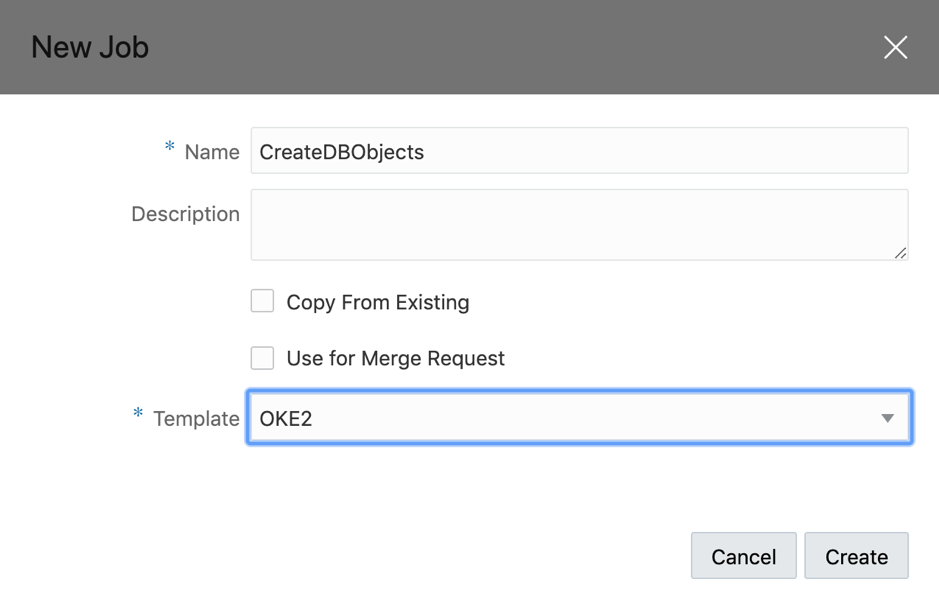
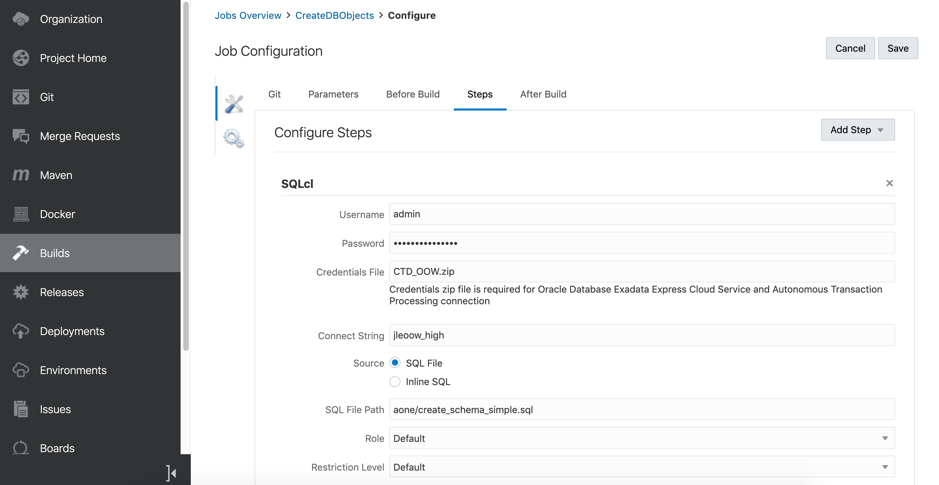

# Microservices on ATP


## Part 2: Data Loading into ATP
#### **Introduction**

In this lab, you will be creating a few tables and inserting data into the ATP database using the CI/CD features of Developer Cloud.  We'll use the Build engine of DevCS to set up a flow that will create the necessary objects in the database, and insert data into the tables.  In case these elements are changed in the repository, the script will trigger again and re-create the database elements.

In real life, you would want to set up a more sophisticated logic to manage your database objects, see [these blogs on the topic by Shay Schmeltzer](https://blogs.oracle.com/shay/devcs).


#### **Objectives**

- Personalize the SQL script with your initials in the db table
- Create and run a Build to create your database objects
- Validate creation via SQLDeveloper


## Steps


### STEP 1: Set up your ATP Wallet in Developer Cloud

In the ATP Connection step of this lab, you downloaded the ATP Connection wallet zip file into the Downloads folder.  We will now unizp the file and copy both the wallet zip file and the folder into the git repository folder.

```bash
cd Downloads

# List downloaded files
ls -l

unzip Wallet_yourwalletfilename.zip -d Wallet_yourwalletfilename

# Move Wallet file and directory into your git repository - assuming you placed it in "dev"
mv Wallet_yourwalletfilename.zip ~/dev/ATPDocker
mv Wallet_yourwalletfilename ~/dev/ATPDocker
```


- On the command line, add the new files to the git repository, commit them and push them to the Developer Cloud with the following commands:

```bash
# Position yourself in the actual Git directory
cd ~/dev/ATPDocker

# add the new files to the git repository
git add .

# Commit the change with the appropriate comment
git commit -m "Add wallet"

# In case you get an error "Please tell me who you are" at this point, please execute below commands:
git config --global user.email "you@example.com"
git config --global user.name "Your Name"

# Push the change from your laptop back into the DevCS repository
git push
```


- Your wallet is now visible in Developer Cloud - you might have to refresh your browser window to see the changes


### **STEP 2: Create and load your data in the database**

- In Developer Cloud, navigate to the "Builds" tab and select **+Create Job**.
  - Enter a name : **CreateDBObjects**
  - Select the Software Template **OKE2**
  - Hit **Create Job**




- Add a  GIT Source repository


- Select your repository from the list
- Do **not** select the Automatic build on Commit


- Select the tab **Steps** to add a **SQLcl** build step from the dropdown

 


- Fill in the parameters:
  - username of the ATP instance : **admin**
  - password of the ATP instance
  - your wallet .zip file
  - your connect string, for example **jleoow_high**, where *jleoow* is the name of the database
  - the sql file containing the create script: **aone/create_schema.sql**




 -   Now save your Build Config and hit the **Build Now** button.  


In case this is the first build job in your environment, the startup of the Build engine might take up to 10 minutes to complete.  You will notice the build to be "Waiting for Executioner"


You can visualize the log file of your virtual machine, to check any errors you might encounter on this level: 


Now navigate back to the Build job you launched.

 -   After a successfull build you should see following screen :


- You can check the detailed content of the SQL execution in the log file of the build job.


- Optionally you can now re-connect with SQLDeveloper to your database and verify the objects were created correctly.


---

**Congratulations**, You are now ready to move to the next lab.

Use the **Back Button** of your browser to go back to the overview page and select the next lab step to continue.

