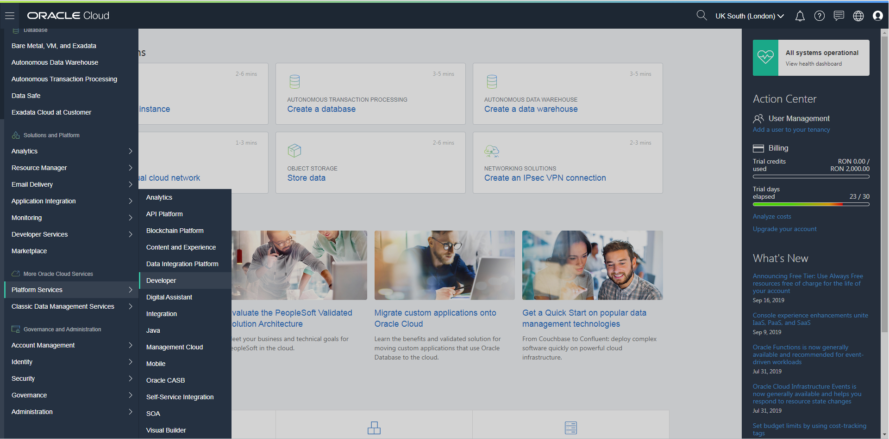
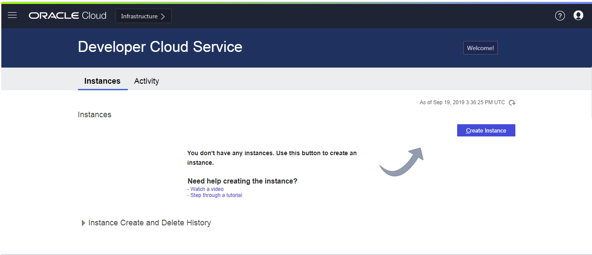
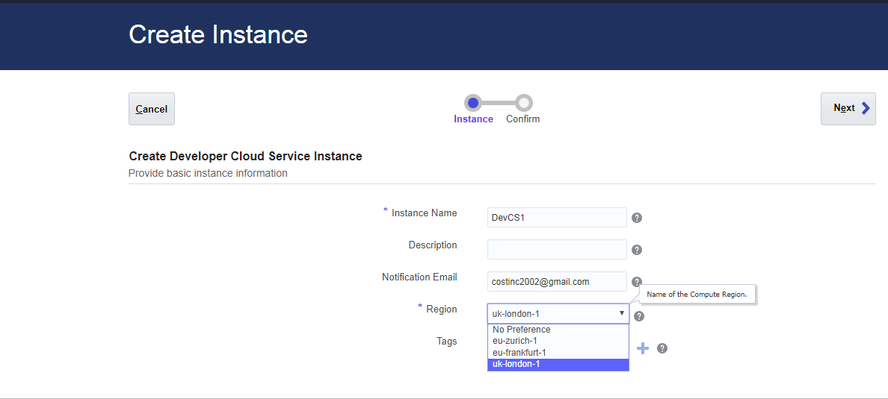
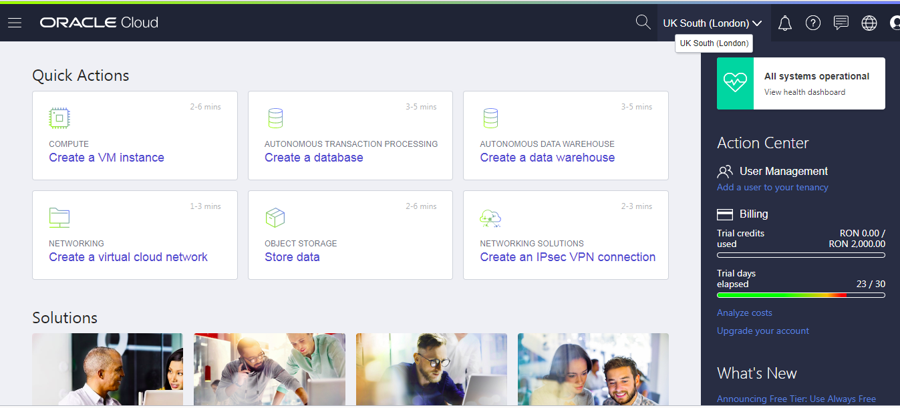
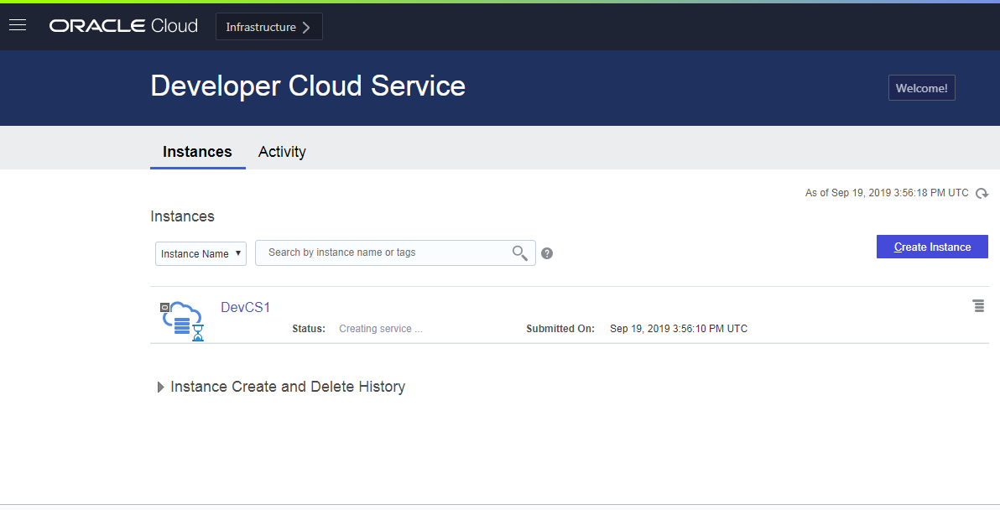
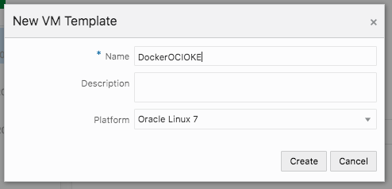
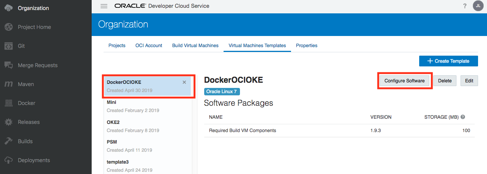
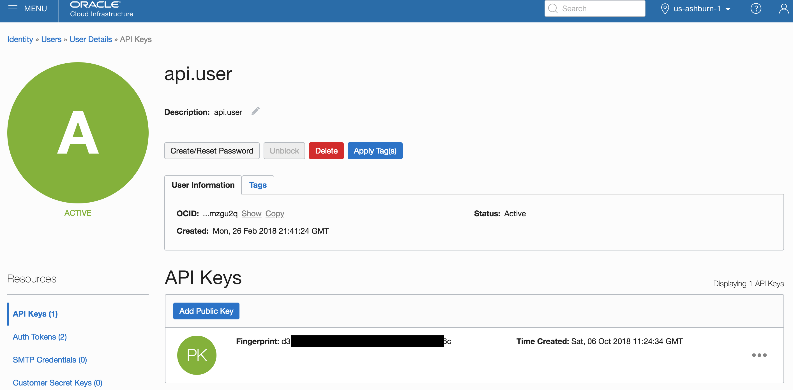
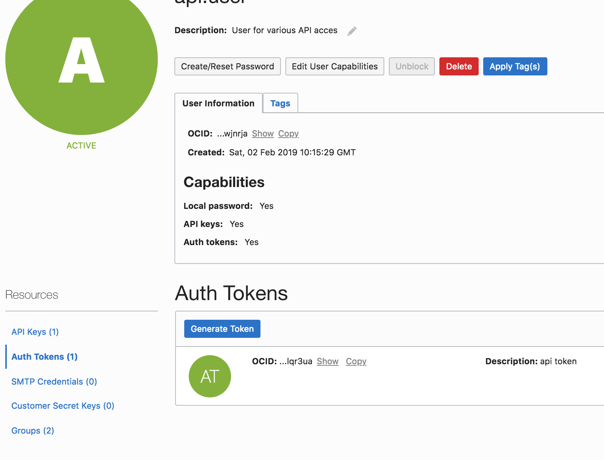

[Go to Overview Page](README.md)


# Microservices on ATP #
## Preparing your Oracle Cloud Tenancy for the lab ##

## Introduction ##

In case you are using a personal instance, either obtained via a free trial or using an existing paying account, you need to ensure the basic services for this lab are up and running, and ensure your user has the right entitlements to execute this lab successfully.

This page will guide you through the following activities :

- Step 1: Set up Developer Cloud Service
- Step 2: Create a compartment called CTDOKE which we will use in this lab
- Step 3: Add a Policy statement for OKE
- Step 4: Create an API user with a certificate
- Step 5: Install some software on your local machine:
  - git
  - kubectl
  - terraform
  - Sql Developer


**ATTENTION** : if you are running this lab in a **Instructor-provided environment**, your Developer Cloud instance has already been created, **you can skip the steps on this page**.  A link to the instance will be provided by your instructor.


## Steps to execute

### Step 1: Setting up Developer Cloud Service ###

This step will guide you through the setup of a new Developer Cloud instance :

- Go to DevCS on your Dashboard
- Creating a Developer Cloud instance
- Configuring the Storage and Build parameters for your DevCS instance


#### Go to DevCS on your dashboard ####

- Login to your cloud account and find DevCS service:



- Open DevCS service

#### Create an instance ####

-  You should have no existing instances.  If you have, you can skip the following steps and just validate you have a build engine witht the correct libraries included.



- Use the "Create Instance" button to create a new Developer Cloud instance



Note: You should match the region selected with your home region.



- Hit the "Next" button and then "Create"


- Now the instance is being created.  This will take a few minutes, you can hit the small arrow to requery the status.



#### Access your DevCS Environment ####

To access your Developer Cloud Instance, refresh the page and use the hamburger menu on the right to view the menu item **Access Service Instance**.  Right-click to save the URL (copy link address), you will need this link later in the labs.


#### Configuring your DevCS Instance ####

Once the instance is available, you need to configure a few things to be able to create projects and run builds:

- Create a dedicated user with specific privileges
- Add a public key to the user profile
- Create a group for DevCS users
- Add a DevCS policy in the **root** compartment
- Then configure the OCI connection using the references to these OCI objects you just created.

You will use the **OCI** type of setup, please ignore the *OCI Classic* setup instructions.

A detailed explanation of these steps is provided in [this section of the Developer Cloud Documentation](https://docs.oracle.com/en/cloud/paas/developer-cloud/csdcs/service-setup.html#GUID-0FCE0C4F-75F4-43BC-8699-EBE039DA5E7A).  Navigate to that page, then use the **Back** button of your browser to returrn to this location.


#### Create a Virtual Machine

- On the left-side menu, select the top level **Organization** menu, then click on **Virtual Machines Templates** in the top menu.  Next you can hit the **Create Template** button.


- In the dialog box, specify a name, for example **DockerOCIOKE**  and use the default **Oracle Linux 7** image.  Then hit the **Create** button.

  


- Now select the template you just created (DockerOCIOKE), and add the required software packages by clicking on the **Configure Software** button.



- Select the following packages:
  - Docker 17,2
  - Kubectl
  - OCIcli ==> this will prompt you to also install Python3
  - SQLcl 18


- Finally, navigate to the **Build Virtual Machines** menu on the top menu, and hit the **+ Create VM** button.

  

  
  
  In the dialog that pops up, enter following values:
  
  - Choose **Quantity = 1**
  
  - Select the **VM Template** you just created: **DockerOCIOKE**
  
  - Set the **Region** to **eu-Frankfurt-1**
  
  - Select the compute **Shape** : **VM.Standard2.2**
  
    

You finished all the steps to finalize the Developer Cloud setup.  


### **STEP 2: Create a Compartment**

- In the Cloud Infrastructure Console, click on the hamburger menu on the top left of the screen. From the pull-out menu, under Identity, click Compartments.


- You will see the list of compartments currently available in your instance, which will include at least the root compartment of your tenancy (with has the tenancy name). 
  - 
- Click on **Create Compartment** button to start the compartment creation process


Enter the following in create Compartment window

- **Name**: Enter **CTDOKE**
- **Description**: Enter a description for the compartment
- **Parent Compartment**:  select the root compartment.
- Click on the **Create Compartment** link 

- You can verify the compartment created on Compartments page


### **STEP 3**: Add a Policy Statement for OKE

- If you are using an Instructor provided instance, this policy will already be defined.

- Before the Oracle managed Kubernetes service can create compute instances in your OCI tenancy, we must explicitly give it permission to do so using a policy statement. From the OCI Console navigation menu, choose **Identity->Policies**.

  

- In the Compartment drop down menu on the left side, choose the **root compartment**. It will have the same name as your OCI tenancy (Cloud Account Name).

  

- Click **PSM-root-policy**

  

- Click the **Add Policy Statement** button

  

- In the Statement box, enter: `allow service OKE to manage all-resources in tenancy` and click **Add Statement**

  


### STEP 4: Create an API user with a certificate

**ATTENTION** : if you are using an Instructor-provided instance, a user called **api.user** will already have been set up for you, and the keys, fingerprints and tokens of this user will be provided to you.

- Add an API (non-SSO) user with an API key:

  - Navigate to the "Identity" , "Users" screen and add a user called "api.user"

  - Add an API key: you need a private/public key pair, and you need to paste the public one into the key field. 

    - On a Mac : open a console window and execute following commands

    - ```
      mkdir ./mykey
      openssl genrsa -out ./mykey/api_key.pem 2048
      openssl rsa -pubout -in ./mykey/api_key.pem -out ./mykey/api_key_public.pem
      ```

    - On a Windows PC, you can use [puttygen](https://www.ssh.com/ssh/putty/download).exe to create a key.

  - Copy the fingerprint of your API key in a temporary file

  - Copy the OCID of this new user in a tempporary file

  


- Create an Auth Token for the user api.user

  - Take care to copy the Token string in a file on your PC : you will nbeed it later, and you cannot retrieve it back from the console.

    

  

### STEP 5: Install the required software on your laptop

#### Installing git

In order to easily update and upload files into your Developer repository, we will clone the newly created DevCS repository onto your machine.  For this you need to install **git** on your laptop.   

- Download the software for your OS on [this location](https://git-scm.com/downloads) 
- In this tutorial we will use the command line to execute the required git operations, but if you have a git GUI installed (like GitHub Desktop or GitKraken) you can execute the equivalent operations through these tools.

#### Installing kubectl

This page covers how to install the Kubernetes command line interface and connect to your Kubernetes cluster

Choose the section that corresponds to your machine:

##### MacOS

Download the latest release with the following `curl` command:

```
$ curl -LO https://storage.googleapis.com/kubernetes-release/release/$(curl -s https://storage.googleapis.com/kubernetes-release/release/stable.txt)/bin/darwin/amd64/kubectl
  % Total    % Received % Xferd  Average Speed   Time    Time     Time  Current
                                 Dload  Upload   Total   Spent    Left  Speed
100 49.9M  100 49.9M    0     0  4289k      0  0:00:11  0:00:11 --:--:-- 4150k
```

Make the kubectl binary executable.

```
$ chmod +x ./kubectl
```

Move the binary in to your PATH.

```
$ mv ./kubectl /usr/local/bin/kubectl
```

Verify the installation using the version command.

```
$ kubectl version
Client Version: version.Info{Major:"1", Minor:"8", GitVersion:"v1.8.4", GitCommit:"9befc2b8928a9426501d3bf62f72849d5cbcd5a3", GitTreeState:"clean", BuildDate:"2017-11-20T05:28:34Z", GoVersion:"go1.8.3", Compiler:"gc", Platform:"linux/amd64"}
The connection to the server localhost:8080 was refused - did you specify the right host or port?
```

At this step the server connection failure is normal. For easier usage it is recommended to setup the autocomplete for bash.

```
$ source <(kubectl completion bash)
```


##### Linux machines

For Linux, use the same sequence as described above for Linux, only replace the CURL command with the following:

```
$ curl -LO https://storage.googleapis.com/kubernetes-release/release/$(curl -s https://storage.googleapis.com/kubernetes-release/release/stable.txt)/bin/linux/amd64/kubectl
  % Total    % Received % Xferd  Average Speed   Time    Time     Time  Current
                                 Dload  Upload   Total   Spent    Left  Speed
100 49.9M  100 49.9M    0     0  4289k      0  0:00:11  0:00:11 --:--:-- 4150k
```

​	Note the difference: you are using /bin/linux/... instead of /bin/darwin/...
​

##### Windows

To find out the latest stable version take a look at [https://storage.googleapis.com/kubernetes-release/release/stable.txt](https://storage.googleapis.com/kubernetes-release/release/stable.txt)

For example if latest stable version is: **v1.8.4** then construct the download link in the following way: *https://storage.googleapis.com/kubernetes-release/release/VERSION_NUMBER/bin/windows/amd64/kubectl.exe*. Thus in case of **v1.8.4** the link looks like this:

[https://storage.googleapis.com/kubernetes-release/release/v1.8.4/bin/windows/amd64/kubectl.exe](https://storage.googleapis.com/kubernetes-release/release/v1.8.4/bin/windows/amd64/kubectl.exe)

Once you have the executable binary add to your PATH variable.

```
set PATH=%PATH%;c:\download_folder\kubectl.exe
```

Verify the installation using the version command.

```
C:\Users\pnagy>kubectl version
Client Version: version.Info{Major:"1", Minor:"7", GitVersion:"v1.7.0", GitCommit:"d3ada0119e776222f11ec7945e6d860061339aad", GitTreeState:"clean", BuildDate:"2
017-06-29T23:15:59Z", GoVersion:"go1.8.3", Compiler:"gc", Platform:"windows/amd64"}
Unable to connect to the server: dial tcp 192.168.99.100:8443: connectex: A connection attempt failed because the connected party did not properly respond after a period of time, or established connection failed because connected host has failed to respond.
```


---


#### Installing terraform

Terraform is an open-source infrastructure as code software tool created by HashiCorp. It enables users to define and provision a datacenter infrastructure using a high-level configuration language known as Hashicorp Configuration Language

- Go to the [Hashicorp Terraform website](https://www.terraform.io/downloads.html) to download the software for your OS
- unzip the executable file in the directory of your choice
- Add the terraform command to your path
  - On Mac: export PATH=$PATH:`pwd`
  - On Windows: go to System Steetings, Advanced, Environment Variables, and add the path to your Terraform directory 


##### Installing Oracle SQL Developer

You should have Oracle SQL Developer installed on your machine. If not, you can download the latest version from [here](https://www.oracle.com/technetwork/developer-tools/sql-developer/downloads/index.html).


---

[Go to Overview Page](README.md)

