[Go to Overview Page](README.md)


# Microservices on ATP #
## Preparing your Oracle Cloud Tenancy for the lab ##

## Introduction ##

In case you are using a personal instance, either obtained via the Oracle Cloud Free Tier or using an existing paying account, you need to ensure the basic services for this lab are up and running, and ensure your user has the right entitlements to execute this lab successfully.

This page will guide you through the following activities :

- Part A : Set up your Cloud Infrastructure
  - Step 1: Create a compartment called CTDOKE which we will use in this lab
  - Step 2: Add a certificate and a token to your user
- Part B : Set up Developer Cloud Service
  - Step 3 : Create an Instance
  - Step 4 : Configure the new DevCS instance


**ATTENTION** : if you are running this lab in a **Instructor-provided environment**, your Developer Cloud instance has already been created, **you can skip the steps on this page**.  A link to the instance will be provided by your instructor.


## Part A : Set up your Cloud Infrastructure


### **STEP 1: Create a Compartment**

- In the Cloud Infrastructure Console, click on the hamburger menu on the top left of the screen. From the pull-out menu, under Identity, click Compartments.


- You will see the list of compartments currently available in your instance, which will include at least the root compartment of your tenancy (with has the tenancy name). 
  - 
- Click on **Create Compartment** button to start the compartment creation process


Enter the following in create Compartment window

- **Name**: Enter **CTDOKE**
- **Description**: Enter a description for the compartment
- **Parent Compartment**:  select the root compartment.
- Click on the **Create Compartment** link 
- You can verify the compartment created on Compartments page


After you successfully created the compartment, note down the **Compartment OCID**, you will need it later in the lab :

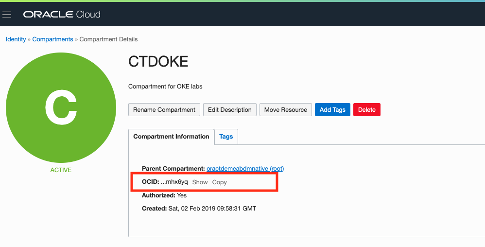


### STEP 2: Create a user certificate and token

First you need to locate your user using the Search functionality of the console:

- Click on the **Magnifying glass** on the top of your console, and enter your username.  For example, if your name was **ppan** : 

  

- Select the user **that looks like :  oracleidentitycloudservice/(your_name)**

  

- Select **Token** in the right-hand menu, then click the button **Create Token**.

  - Enter a name for the token

  - Use the **Copy** button to copy the token in your buffer, and **immediately paste it** in a notebook of your choice, you will need this later.

    

    

- Add an API key:

  - In the left-hand menu, click on the **API Keys** menu

  - Add an API key: you need a private/public key pair, and you need to paste the public one into the key field. 
  
    - An **Example** is proveded below: both private and public keys are made available, so obviously this is **not good security practice**.
  
      - [Public key](keys/api_key_public.pem)
      - [Private key](api_key.pem)
  
    - **Good practice** is to generate your own keys: You can use the following [OpenSSL](http://www.openssl.org/) commands to generate the key pair in the required PEM format. You can use the Oracle Cloud Shell to issue these commands: use the "**>_**" icon in the top right of your console.
  
      - Open a Cloud Shell and execute following commands
  
        - ```
          mkdir ./mykey
          openssl genrsa -out ./mykey/api_key.pem 2048
          openssl rsa -pubout -in ./mykey/api_key.pem -out ./mykey/api_key_public.pem
          ```
        
      - For more details on this key creation, see the [documentation](https://docs.cloud.oracle.com/iaas/Content/API/Concepts/apisigningkey.htm).
  
  - Once you have the key pair available, return to the detailed screen of your user
  
    - Click on the **Add Public Key** button
    - Either select the local file containing the public key, or paste the content of the file into the "Public Key" field.
    - Click **Add** to create the key
  
  - Copy the fingerprint of your API key in a temporary file
  
  - Copy the OCID of this user in a temporary file
  
  


## Part B : Set up your Developer environment


### Step 3 : Setting up Developer Cloud Service ###

This step will guide you through the setup of a new Developer Cloud instance :

- Go to DevCS on your Dashboard
- Creating a Developer Cloud instance
- Configuring the Storage and Build parameters for your DevCS instance


#### Go to DevCS on your dashboard ####

- Login to your cloud account and find DevCS service:


- Open DevCS service


#### Create an instance ####

-  You should have no existing instances.  If you have, you can skip the following steps and just validate you have a build engine witht the correct libraries included.


- Use the "Create Instance" button to create a new Developer Cloud instance


Note: You should match the region selected with your home region.


- Hit the "Next" button and then "Create"

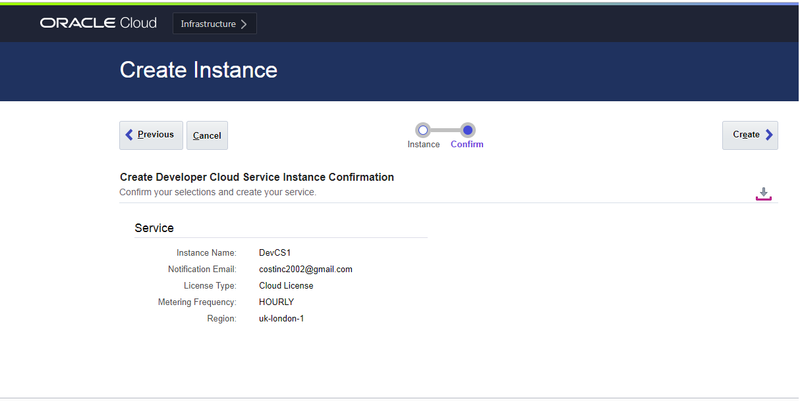


- Now the instance is being created.  This will take a few minutes, you can hit the small arrow to requery the status.


#### Access your DevCS Environment ####

To access your Developer Cloud Instance, refresh the page and use the hamburger menu on the right to access the menu item **Access Service Instance**. 


### Step 4 : Configure DevCS Compute & Storage using OCI credentials

To configure DevCS to use the OCI Compute resources for its build engines, we need to manually provide the OCI credentials in the DevCSD setup menu.

**Attention !!** 

In the following section you will need to switch repeatedly between the DevCS console (on the left in the below screenshot, the "OCI Credentials" screen) and the OCI Cloud Interface where you need to collect a number of parameters of your instance (on the right in the below screenshot)

**Take a minute to set up 2 browser windows that allow easy switching between these 2 screens** to cut and paste parameters between them ! 

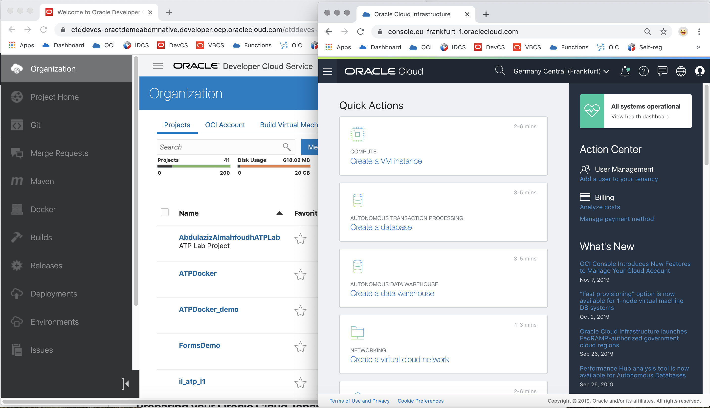


- In DevCS, on the left-side menu, select the top level **Organization** menu, then click on **OCI Account** in the top menu.  Next you can hit the **Connect** button.

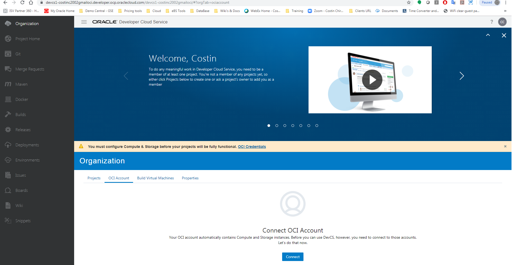

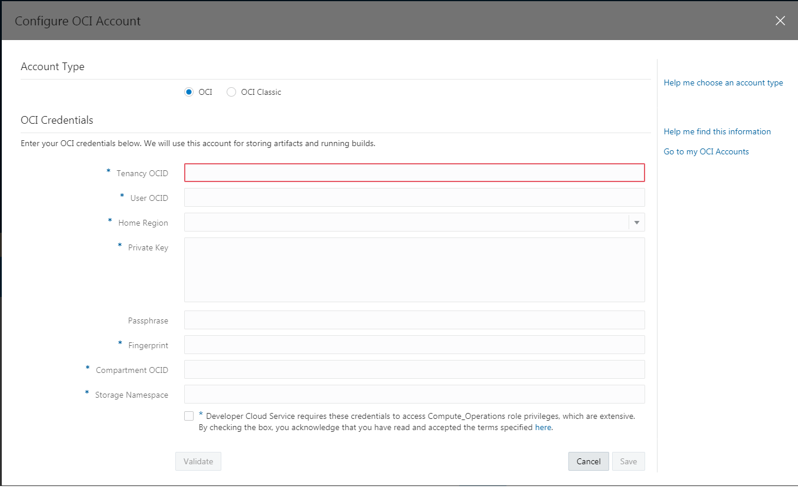

- The OCI credentials can be found in your main cloud dasboard / Administration / Tenancy details

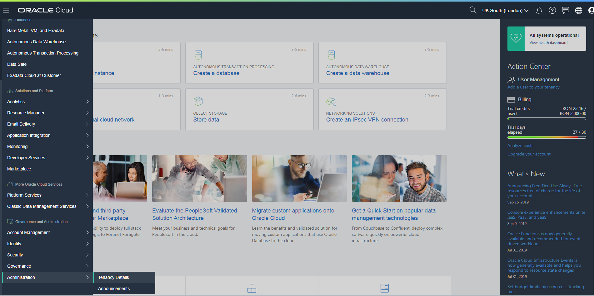

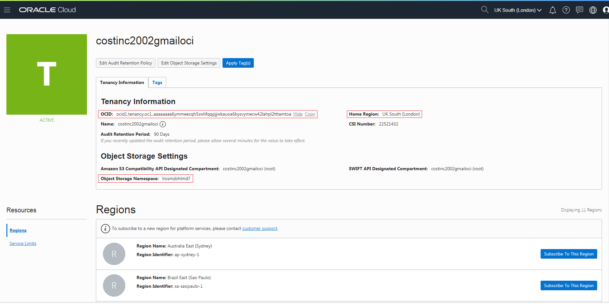

- The user details can be found in your main cloud dasboard / Identity/ Users / click on api.user


- You should have noted the OCID of the **CTDOKE** Compartment earlier in this section just after the creation.


#### Create a Virtual Machine

- On the left-side menu, select the top level **Organization** menu, then click on **Virtual Machines Templates** in the top menu.  Next you can hit the **Create Template** button.

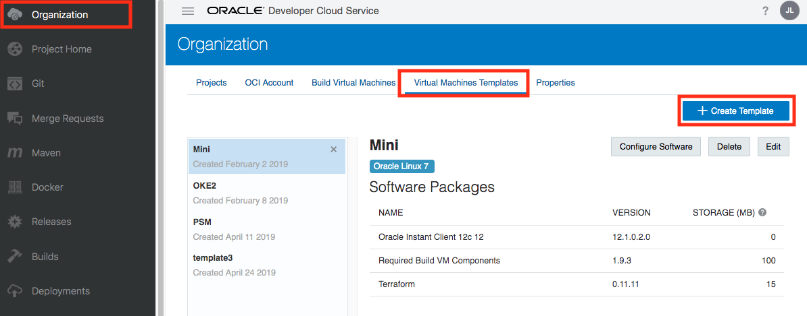


- In the dialog box, specify a name, for example **OKE2**  and use the default **Oracle Linux 7** image.  Then hit the **Create** button.

  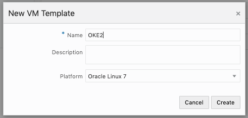


- Now select the template you just created (OKE2), and add the required software packages by clicking on the **Configure Software** button.

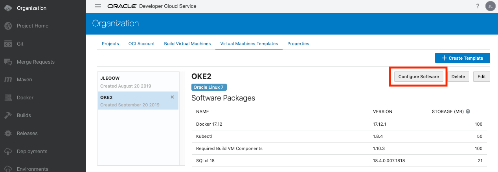

- Select the following packages:
  - Docker 17.2
  - Kubectl
  - OCIcli ==> this will prompt you to also install Python3
  - SQLcl 18


- Finally, navigate to the **Build Virtual Machines** menu on the top menu, and hit the **+ Create VM** button.

  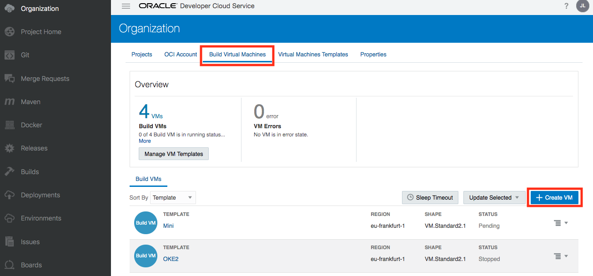

  
  
  In the dialog that pops up, enter following values:
  
  - Choose **Quantity = 1**
  
  - Select the **VM Template** you just created: **OKE2**
  
  - Set the **Region** to **eu-Frankfurt-1**
  
  - Select the compute **Shape** : **VM.Standard2.1**
  
    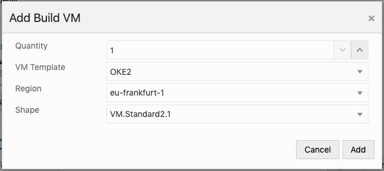

You finished all the steps of the Developer Cloud setup.  


---

[Go to Overview Page](README.md)

