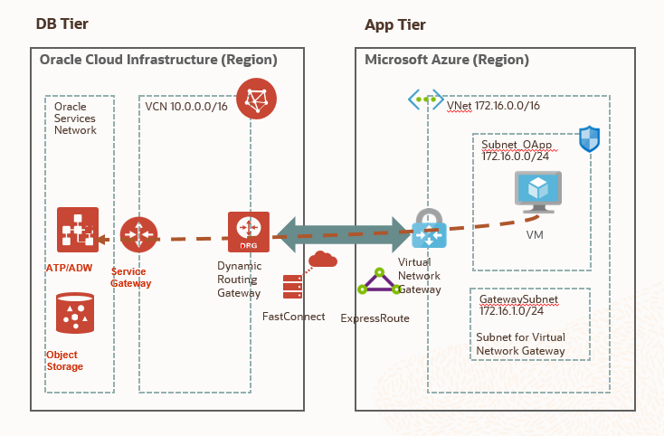

[Go to the Cloud Test Drive Welcomer Page](../../readme.md)

# Building Multi-Cloud Apps on Microsoft Azure and Oracle Cloud Infrastructure

## Developing an ASP.NET web application hosted on Azure and connecting it to Oracle Autonomous Database using private cross-cloud networking interconnectivity

## Introduction

This lab will walk you through the process of developing and deploying a web application across Oracle Cloud Infrastructure and Microsoft Azure. For an App Tier you will be using Oracle Data Provider for .NET (ODP.NET) within Visual Studio in order to configure  and deploy an ASP.NET web application hosted on Azure VM. Then you will be build DB Tier using Oracle Autonomous Transaction Processing Database running in the Oracle Cloud Infrastructure. In the last step, you will set up cross-cloud interconnectivity between Oracle Cloud Infrastructure (OCI) and Microsoft Azure. 

Before you start building the application, let’s take a quick glance at the architecture diagram. 

The application tier writes and queries data to and from the database tier over a secure private connection by using [VCN Transit Routing](https://docs.cloud.oracle.com/iaas/Content/Network/Tasks/transitroutingoracleservices.htm?). Transit routing refers to a network setup in which your Azure VNet network uses a connected virtual cloud network (VCN) to reach Oracle resources or services beyond that VCN. You will connect the Azure VNet network through [ExpressRoute](https://docs.microsoft.com/en-us/azure/expressroute/expressroute-introduction) to the VCN with [FastConnect](https://docs.cloud.oracle.com/en-us/iaas/Content/Network/Concepts/fastconnect.htm) and then configure the VCN routing so that traffic transits through the VCN to its destination beyond the VCN (Autonomous Database in this case).

  

​                                                                             

## Prerequisites

Before you start running these labs, please check the prerequisites below: 

- You must have an active Azure subscription and OCI tenancy.  If you do not have the accounts yet, you can obtain an Oracle Free Tier account [here](https://myservices.us.oraclecloud.com/mycloud/signup?sourceType=:eng:eo:ie::RC_EMMK190926P00040:Vlab_microATPnov) and Azure Free account [here](https://azure.microsoft.com/en-us/free/?utm_source=channel9&utm_medium=descriptionlinks&utm_campaign=freeaccount&ocid=AID754288&wt.mc_id=azfr-c9-niner%2CCFID0519). Please use your e-mail address used during registration to that event.

  **NOTE: If you are going to use your own existing Azure and OCI accounts, please check first the costs of provisioning [FastConnect](https://www.oracle.com/cloud/networking/fastconnect.html) and [ExpressRoute](https://azure.microsoft.com/en-us/pricing/details/expressroute/) circuit.**

- If you are using your own Azure subscription, you must first be enabled for OCI interconnectivity.      You must enroll in the preview by completing this short [survey form](https://forms.office.com/Pages/ResponsePage.aspx?id=v4j5cvGGr0GRqy180BHbRyzVVsi364tClw522rL9tkpUMVFGVVFWRlhMNUlRQTVWSTEzT0dXMlRUTyQlQCN0PWcu). You will receive an email back once your subscription has been enrolled. 

- Connectivity is only possible where an Azure ExpressRoute peering location is in proximity to or in the same peering location as the OCI FastConnect. See [preview limitations](https://docs.microsoft.com/en-us/azure/virtual-machines/workloads/oracle/oracle-oci-overview).                                                                                              The connection is currently available only in these areas: 
  
  - Between the Oracle Cloud Infrastructure location in the US East (Ashburn) region and the [Azure Washington DC and Washington DC2 locations](https://docs.microsoft.com/en-us/azure/expressroute/expressroute-locations-providers).
  - Between the Oracle Cloud Infrastructure location in the UK South (London) region and the [Azure London location](https://docs.microsoft.com/en-us/azure/expressroute/expressroute-locations-providers). 
  - Between the Oracle Cloud Infrastructure location in the Canada Southeast (Toronto) region and the [Azure Canada Central location](https://docs.microsoft.com/en-us/azure/expressroute/expressroute-locations-providers). 
  
  - Between the Oracle Cloud Infrastructure location in the Netherlands Northwest (Amsterdam) region and the [Azure Amsterdam2 locations](https://docs.microsoft.com/en-us/azure/expressroute/expressroute-locations-providers).
- Using ExpressRoute (Azure) and FastConnect (OCI), you can peer a virtual network in Azure with a virtual cloud network in OCI, provided that the private IP address space does not overlap.

## Components of this lab

This lab is composed of the steps outlined below.  Please walk through the various labs in a sequential order, as the different steps depend on each other:

- **Part 1:** [Creating Azure VNet with subnets and network virtual gateway](LabGuide100CreateAzureVNet.md).
- **Part 2:** [Creating OCI VCN with Dynamic Routing Gateway and Service Gateway](LabGuide200CreateVCNandGateways.md). 
- **Part 3:** [Provisioning an Autonomous Transaction Processing Database Instance](LabGuide300ProvisionAutonomousDatabase.md).
- **Part 4:** [Developing and deploying ASP.NET Application](LabGuide400DevelopAppASP.NET.md)
- **Part 5:** [Creating Cross-Cloud Interconnection](LabGuide500CreateInterConnection.md)
- **Part 6 [Optional]:** [Terminating Cross-Cloud Interconnection](LabGuide600TerminateInterConnection.md)

---

[Go to the Cloud Test Drive Welcomer Page](../../readme.md)

#### [License](../../LICENSE)

Copyright (c) 2014, 2016 Oracle and/or its affiliates
The Universal Permissive License (UPL), Version 1.0