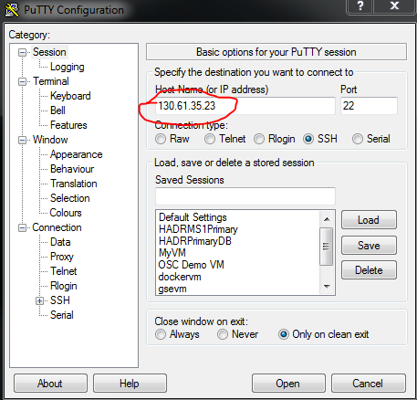
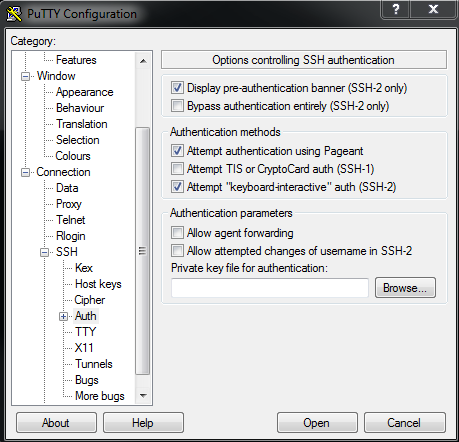
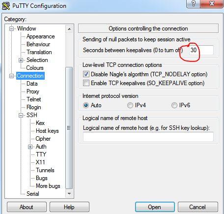
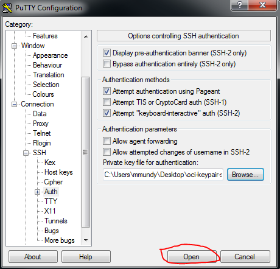
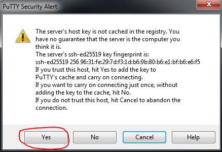

# Appendix A: How do you use Putty with Windows to ssh to an OCI based virtual machine?

As part of this hands on lab there is a need to ssh on to a virtual machine. If you are using a Windows based laptop and are not sure how to use the ssh client Putty, available to install, this guide will help.

Download the latest release of Putty for Windows here : https://www.putty.org/

Double click on the downloaded installer and follow the instructions to simply install on your laptop.

Execute Putty from the desktop shortcut created at installation time or by searching for putty in the Windows 'Start' search.

Using the Public IP Address for the virtual machine you want to ssh to enter this in the 'Hostname (or IP address) section of the Putty configuration screen.

Now in the left-hand pane select Connection → SSH → Auth

Press the 'Browse' button and search for the private key file downloaded as part of the artifacts.zip earlier. You are looking for the file **id_rsa.ppk**

If you wish to enable connection keepalive (if you experience session dropout) select Connection and give a value for the 'Seconds between keepalives ...'

The screen below should help here.

Now press the 'Open' button at the bottom of the panel.

Say 'Yes' to trust the key and add it to Putty's cache.

Give the username as opc when prompted in the new putty terminal session and hit RETURN

You should now be logged in to your virtual machine!

