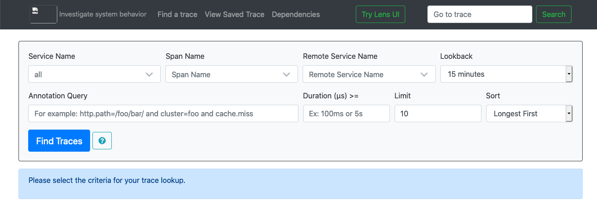
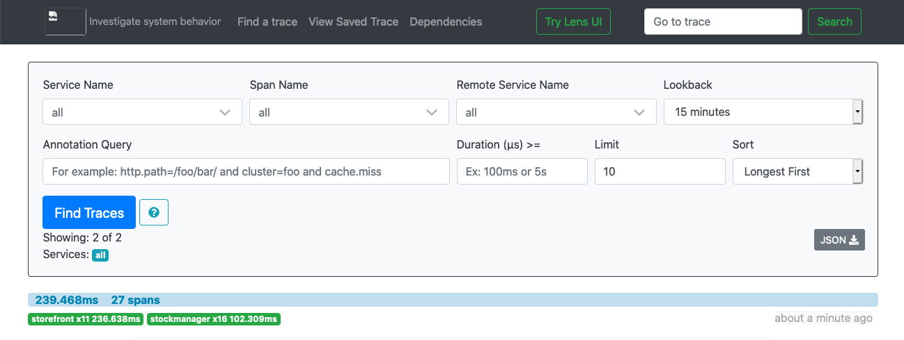
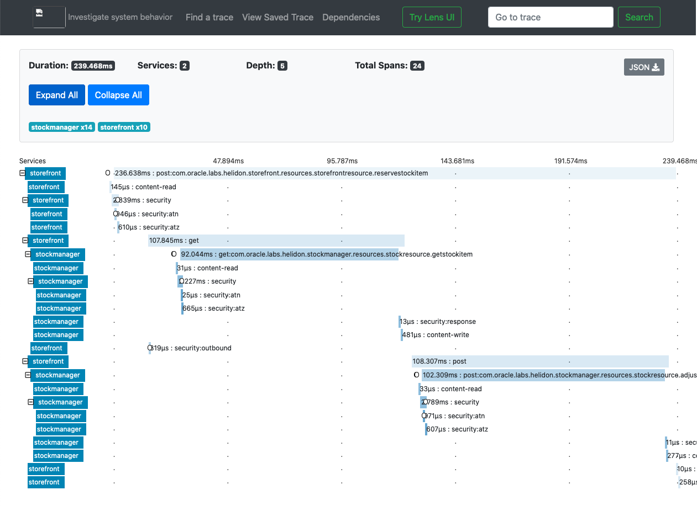
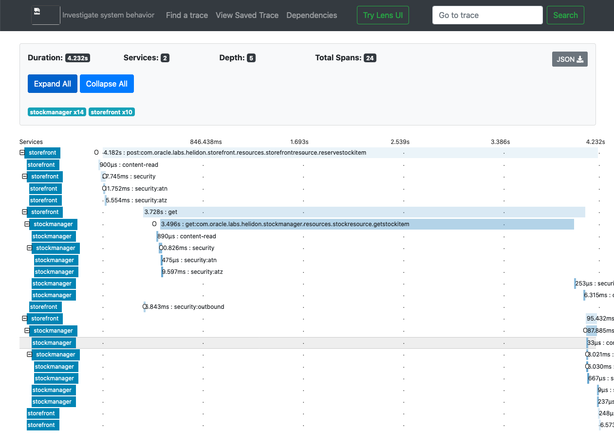

[Go to Helidon for Cloud Native Page](../Helidon-labs.md)


# Migration of Monolith to Cloud Native

## A. Helidon for Cloud Native

## 4. Helidon and operations

One thing that many developers used to forget is that once they have finished writing code it still has to run and be maintained. With the introduction of DevOps a lot of developers suddenly found they were the ones being woken up in the middle of the night to fix problems in their code. That changes the perception somewhat and now many developers are acutely aware that they will have ongoing involvement in the code well after the time it compiles cleanly and passed the text suite.

To help maintain and operate systems after they have been released a lot of information is needed, especially in situations where a bug may be on one service, but not show up until the resulting data has passed through several other microservcies. 

Equally performance information is key to understanding how well the services are running, and in the event of a performance problem which specific microservice it it that's got the problem!

Fortunately for us and other developers Helidon has support for tools and and producing data that will help diagnose problems, and determine if there is a problem in the first place.

### Tracing
We now managed to achieve the situation where we have a set of microservices that cooperate to perform specific function. However we don't know exactly how they are operating in reality, we do of course know how they operate in terms of our design!

Tracing in a microservices environment allows us to see the flow of a request across all of the microservices involved, not just the sequence of method calls in a particular service. 

Helidon has built-in support for tracing. There are a few steps that we need to take to activate this.

Firstly we need to deploy a tracing engine, Helidon supports several tracing engines, but for this lab we will use the Zipkin engine. For now we will use docker to run Zipkin. In the Kubeneres labs we will see how we can run Zipkin in Kubernetes.

In the VM you have docker installed and running, so to start zipkin:

- Open a terminal on your Linux desktop
- Run the following command to start Zipkin in a container:
  - `docker run -d -p 9411:9411 --name zipkin --rm openzipkin/zipkin`

```
Starting zipkin docker image in detached mode
d12b253c50b7793ca8e3eb64658efead336fa3880d3df040f12152b57347f067
```

- Now open a browser in the **Virtual machine desktop** 
- Navigate to : http://localhost:9411/zipkin/ 



Now you need to add the zipkin packages to the pom.xml file for **both** the storefront and stockmanager projects. This will trigger Helidon to automatically setup the tracing, no code changes are needed by you at all to use the tracing.

For **both** the storefront and stockmanager projects open the pom.xml file, this is in the top level of the project, towards the end of the files for the project.

Look for the dependency `helidon-tracing-zipkin` in **each** pom.xml file, you may want to use the search facility to look for zipkin. You will find a section that has been commented out and looks like the following

```
		<!-- tracing calls -->
		<!-- 
		<dependency>
			<groupId>io.helidon.tracing</groupId>
			<artifactId>helidon-tracing-zipkin</artifactId>
		</dependency>
		-->
```

- Remove the `<!--` and `-->` around the dependency ONLY

The result will look like 

```
		<!-- tracing calls -->
		<dependency>
			<groupId>io.helidon.tracing</groupId>
			<artifactId>helidon-tracing-zipkin</artifactId>
		</dependency>
```

You now need to tell Helidon what to call the tracing requests and where traces should be sent.

- In the **storefront** project, navigate to the toplevel folder **conf** and open file **storefront-config.yaml**

- Uncomment the **tracing** lines to specify the relevant project name as the service and the host as "zipkin"

  - ```
    tracing:
      service: "storefront"
      host: "zipkin"
    ```

- Navigate to the **stockmanager** project, open the **conf** folder and open file **stockmanager-conf.yaml**

- Uncomment the **tracing** lines 

  - ```
    tracing:
      service: "stockmanager"
      host: "zipkin"
    ```

    

- **Stop** any existing storefront and stockmanager instances

- Then **restart** them.


- Make a request, for example reserving stock (this may take a few seconds due to the lazy initialization) :
  -  `curl -i -X POST -u jill:password -d '{"requestedItem":"Pencil", "requestedCount":7}' -H "Content-type:application/json" http://localhost:8080/store/reserveStock`

```
HTTP/1.1 200 OK
Content-Type: application/json
Date: Mon, 6 Jan 2020 15:46:29 GMT
connection: keep-alive
content-length: 37

{"itemCount":143,"itemName":"Pencil"}
```

We've successfully reserved 7 pencils

- Go to the **zipkin web page** and click find traces, you'll see the list of traces (the details you have will of course be different)




Here you can see that is took 236.638ms doign storefront related parts of the request and only 102.309ms doing the stock manager parts of the request.

If we click on the overall time (`239.468ms 27 spans` in this case, though your numbers will vary) zipkin will display the full details of our trace.



Importantly even though they are in separate microservices and the flow switches between them several times we can see the overall flow, what part of the service was called when and how long it took. This let's developers understand exactly how the initial request was processed and how long each step took.

I restarted both the storefront and stockmanager service, so the lazy initialization around the REST infrastructure and the database had not yet happened, then made the same request. This took a lot longer as the framework had to do it's on-demand initialization.



As you can see it took a long time for the stockmanager to perform it's initial action, but subsequent requests to the stockmanager were much faster. A developer may look at this trace and decide that it would be a good thing if the stockmanager took an action during it's initialization to setup the database connection, which would speed the first request up for users.

### Metrics
Tracking solutions like Zipkin can provide us with detail on how a single request is processed, but they are not going to be able to tell us how many requests were made, and what the distribution of requests per second is. This is the kind of thing that is needed by the operations team to understand how the microservice is being used, and where enhancements may be a good idea (especially where to focus development work for performance enhancements)

The pom.xml will need to be updated for the metrics, that's already been done for you here.

- Go to the project **Storefront**, and navigate to folder **resources**
- Open the file **StorefrontResources.java**.
- Add the following annotation:
  -  `@Counted(monotonic = true)`

```
@Path("/store")
@RequestScoped
@Counted(monotonic = true)
@Authenticated
@Timeout(value = 15, unit = ChronoUnit.SECONDS)
@Log
@NoArgsConstructor
public class StorefrontResource {
```

<details><summary><b>Details on the annotation</b></summary>
<p>

The `monotonic=true` means that the counters will increment when the method is called, but will not decrement when it's exited. If you wanted to have a particular method report how many threads were currently in it (perhaps to determine when resource limits may be reached) you'd use `@Counted(monotonic=false)` which would decrement the counter when a thread left the method giving the number of threads in a method.

A note on names, the default name for a counter is based on the class and method, that can be long (as we'll see in the output soon) but you can override the default name and for counters on *methods* you can specify a name for the counter E.g. `@Counted(names="MyListCounter")` This makes the output easier to understand, but do please chose a sensible name. You can also specify a description of the counter and help text if you like (examples of system generated versions are below)

That's it, you don't need to do anything else, Helidon will automatically generate a set of counters for all of the requests it processes.

</p></details>

---


- Restart the storefront service.
- Now look at the metrics endpoint :
  - `curl -i -X GET http://localhost:9080/metrics`

```
HTTP/1.1 200 OK
Content-Type: text/plain;charset=UTF-8
Date: Mon, 6 Jan 2020 16:43:11 GMT
connection: keep-alive
content-length: 22309

# TYPE base:classloader_current_loaded_class_count counter
# HELP base:classloader_current_loaded_class_count Displays the number of classes that are currently loaded in the Java virtual machine.
base:classloader_current_loaded_class_count 8181
...
...
a lot more !!!!
...
...
# TYPE vendor:requests_meter_one_min_rate_per_second gauge
vendor:requests_meter_one_min_rate_per_second 0.0
# TYPE vendor:requests_meter_five_min_rate_per_second gauge
vendor:requests_meter_five_min_rate_per_second 0.0
# TYPE vendor:requests_meter_fifteen_min_rate_per_second gauge
vendor:requests_meter_fifteen_min_rate_per_second 0.0
```

It'a **lot** of data, but it's broken up into sections.

<details><summary><b>Diving into the tracing details</b></summary>
<p>

The `base` data e.g. 

```
# TYPE base:classloader_current_loaded_class_count counter
# HELP base:classloader_current_loaded_class_count Displays the number of classes that are currently loaded in the Java virtual machine.
base:classloader_current_loaded_class_count 8181
```
is core data about the operation of the JVM, this is the kind of data you care about if you want to do things like customize the garbage collector (though I recommend never doign that as nowadays it's highly adaptive and will do a way better job at figuring out how it should behave than you'll ever do)

The requests under the `vendor` section relate to the Helidon frameworks operation

```
# TYPE vendor:requests_count counter
# HELP vendor:requests_count Each request (regardless of HTTP method) will increase this counter
vendor:requests_count 0
```

The data under the `application`` section relate to counters applied on the application code itself.

```
# TYPE application:com_oracle_labs_helidon_storefront_resources_storefront_resource_list_all_stock counter
# HELP application:com_oracle_labs_helidon_storefront_resources_storefront_resource_list_all_stock 
application:com_oracle_labs_helidon_storefront_resources_storefront_resource_list_all_stock 0
# TYPE application:com_oracle_labs_helidon_storefront_resources_storefront_resource_reserve_stock_item counter
# HELP application:com_oracle_labs_helidon_storefront_resources_storefront_resource_reserve_stock_item 
application:com_oracle_labs_helidon_storefront_resources_storefront_resource_reserve_stock_item 0
```

These ones tell us how often the ListAllStock and reserveStockItem methods have been called. 

Lastly you'll see there are quite a lot that start `application:ft_`

```
# TYPE application:ft_com_oracle_labs_helidon_storefront_resources_storefront_resource_failed_list_stock_item_invocations_total counter
# HELP application:ft_com_oracle_labs_helidon_storefront_resources_storefront_resource_failed_list_stock_item_invocations_total The number of times the method was called
application:ft_com_oracle_labs_helidon_storefront_resources_storefront_resource_failed_list_stock_item_invocations_total 0
```

These are generated automatically because we've enabled fault tolerance, the ft_ counters keep track of how many dined the fallback has been called, if the fallback returned useful data or itself generated an exception and so on.

As we only just restarted the storefront it's not a surprise that these are all zero.

</p></details>

---


### Limiting the output

If you like you can limit the scope of the returned metrics by specifying the scope in the request:

-  `curl -i -X GET http://localhost:9080/metrics/application`

```
HTTP/1.1 200 OK
Content-Type: text/plain;charset=UTF-8
Date: Mon, 6 Jan 2020 17:07:17 GMT
connection: keep-alive
content-length: 15576

# TYPE application:com_oracle_labs_helidon_storefront_resources_storefront_resource_storefront_resource counter
# HELP application:com_oracle_labs_helidon_storefront_resources_storefront_resource_storefront_resource 
application:com_oracle_labs_helidon_storefront_resources_storefront_resource_storefront_resource 5
...
...
```

Of if you're only interested in a specific metric you can just retrieve that, provided it's been named.


### With real counter data

Let's make a couple of list stock requests, then look at the list_all_stock counter

- Run the following command 5 times : 
  -  `curl -i -X GET -u jill:password http://localhost:8080/store/stocklevel`

```
HTTP/1.1 200 OK
Content-Type: application/json
Date: Mon, 6 Jan 2020 16:58:21 GMT
connection: keep-alive
content-length: 148

[{"itemCount":5000,"itemName":"pin"},{"itemCount":136,"itemName":"Pencil"},{"itemCount":50,"itemName":"Eraser"},{"itemCount":100,"itemName":"Book"}]
```
Now let's look at the metrics (I removed a bunch of unneeded output here to focus on the counters):

-  `curl -i -X GET http://localhost:9080/metrics/`

```
HTTP/1.1 200 OK
Content-Type: text/plain;charset=UTF-8
Date: Mon, 6 Jan 2020 16:59:03 GMT
connection: keep-alive
content-length: 22467

# TYPE base:classloader_current_loaded_class_count counter
# HELP base:classloader_current_loaded_class_count Displays the number of classes that are currently loaded in the Java virtual machine.
base:classloader_current_loaded_class_count 9941
...
...
# TYPE base:thread_max_count counter
# HELP base:thread_max_count Displays the peak live thread count since the Java virtual machine started or peak was reset. This includes daemon and non-daemon threads.
base:thread_max_count 83
# TYPE application:com_oracle_labs_helidon_storefront_resources_storefront_resource_storefront_resource counter
# HELP application:com_oracle_labs_helidon_storefront_resources_storefront_resource_storefront_resource 
application:com_oracle_labs_helidon_storefront_resources_storefront_resource_storefront_resource 5
...
...
```

We can see that now 5 requests in total have been made to the storefront resource, and 5 requests to the listAllStock method, the others have had none. If we were looking for a place to optimize things then perhaps we might like to consider looking at that method first !


Why port 9080 ? Well you may recall that in the helidon core lab we defined the network as having two ports, one for the main application on port 8080 and another for admin functions on port 9080, we then specified that metrics (and health which we'll see later) were in the admin category so they are on the admin port. It's useful to split these things so we don't risk the core function of the microservice getting mixed up with operation data.  

### Other types of metrics
There are other types of metrics, for examples times. 

- open the file **StorefrontResource.java**

- Locate the method **listAllStock**

- Add a timer and a meter annotation:

  - ```
    @Timed(name = "listAllStockTimer")
    @Metered(name = "listAllStockMeter", absolute = true)
    ```

Result:

```
	@GET
	@Path("/stocklevel")
	@Produces(MediaType.APPLICATION_JSON)
	@Fallback(fallbackMethod = "failedListStockItem")
	@Timed(name = "listAllStockTimer")
	@Metered(name = "listAllStockMeter", absolute = true)
	public Collection<ItemDetails> listAllStock() {
```

The *absolute=true* on the meter means that the class name won't be prepended, it will just be called listAllStockMeter 


- Now **restart** the **storefront** and make a few calls
-  `curl -i -X GET -u jill:password http://localhost:8080/store/stocklevel`

```
HTTP/1.1 200 OK
Content-Type: application/json
Date: Mon, 6 Jan 2020 17:19:49 GMT
connection: keep-alive
content-length: 148

[{"itemCount":5000,"itemName":"pin"},{"itemCount":136,"itemName":"Pencil"},{"itemCount":50,"itemName":"Eraser"},{"itemCount":100,"itemName":"Book"}]
```


Now let's get the details specific to our named meter by specifying it in the metrics data request:

-  `curl -i -X GET http://localhost:9080/metrics/application/listAllStockMeter`

```
HTTP/1.1 200 OK
Content-Type: text/plain;charset=UTF-8
Date: Mon, 6 Jan 2020 17:20:41 GMT
connection: keep-alive
content-length: 726

# TYPE application:list_all_stock_meter_total counter
# HELP application:list_all_stock_meter_total 
application:list_all_stock_meter_total 5
# TYPE application:list_all_stock_meter_rate_per_second gauge
application:list_all_stock_meter_rate_per_second 0.08133631423819475
# TYPE application:list_all_stock_meter_one_min_rate_per_second gauge
application:list_all_stock_meter_one_min_rate_per_second 0.03716438621959536
# TYPE application:list_all_stock_meter_five_min_rate_per_second gauge
application:list_all_stock_meter_five_min_rate_per_second 0.014179223683357264
# TYPE application:list_all_stock_meter_fifteen_min_rate_per_second gauge
application:list_all_stock_meter_fifteen_min_rate_per_second 0.005264116322948982
```

### Combining counters, metrics, times and so on
You can have multiple annotations on your class / methods, but be careful that you don't get naming collisions, if you do your program will likely fail to start.

By default any of `@Metric`, `@Timed`, `@Counted` etc. will use a name that's depending on the class / method name, it does **not** append the type of thing it's looking for. So if you had `@Counted` on the class and `@Timed` a class (or `@Counted` and `@Timed` on a particular method) then there would be a naming clash between the two of them. It's best to get into the habit of naming these, and putting the type in the name. Then you also get the additional benefit of being able to easily extract it using the metrics url like `http://localhost:9080/metrics/application/listAllStockMeter`


### End of the lab
You have finished this part of the lab, you can proceed to the next step of this lab:


[5. The Helidon support for Cloud Native Operations lab](../Helidon-cloud-native/helidon-cloud-native.md)


---


[Go to *Helidon for Cloud Native* overview Page](../Helidon-labs.md)