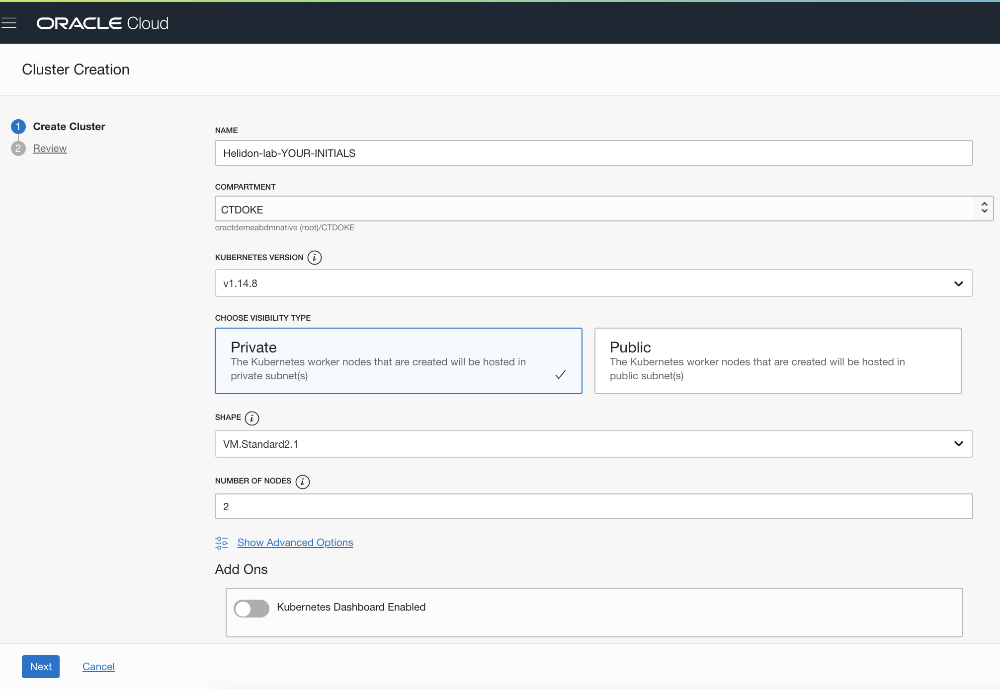

# Creating your own Kubernetes cluster in the OCI tenancy

This page details the instructions to spin up a Managed Kubernetes cluster on the Oracle Cloud.  

---

**ATTENTION !!!** 

Your instructor will inform you if the Kubernetes clusters have already been created for you or not.  

- In case you need create them yourselves, follow the instructions below.
- If the clusters are already running, your kubeconfig file will be provided by your instructor

---

- Make sure you are working in your Virtual Linux environment using your VNC viewer. 


**Navigate to the Managed Kubernetes dashboard**

- Log into the **Cloud Console** using the URL provided, and using the username and password you created earlier.
- Once on the **OCI infrastructure** page, click on the hamburger menu to navigate to 
  - **Developer services**, then **Container Clusters (OKE)**

- In the **List Scope** section, use the dropdown to select the **CTDOKE** compartment
  - You may have to expand the tree nodes to locate this compartment
- Click the **Create Cluster** button at the top of the clusters list

- Choose the option for the **Quick Create**, then click the **Launch workflow** button


**Creating the cluster**

- Fill in the form with following parameters:

  - In the next form name the cluster something like Helidon-Lab-YOUR-INITIALS
  - Make sure the compartment is **CTDOKE**
  - Make sure the Kubernetes version is the highest on the list (at the time of writing that was 1.15.7)
  - Leave the visibility type as **private**
  - Set the shape to VM.Standard2.1
  - Set the number of nodes to be 2

  - **TURN OFF** the Add Ons : make sure that the sliders for **Kubernetes Dashboard** and **Tiller (Helm)**  are grey ("switch" to the left")



- Click the Next button to go to the review page.

- On the review page check the details you have provided are correct
- Click the Create Cluster button.

You'll be presented with a progress option, if you want read what's happening

- Scroll to the bottom and click the **Close** button

The state will be "Creating" for **a few minutes** (usually 3-4 mins)

Once the cluster has been created the "Accesss Kubeconfig" button will be enabled. 

- Create a directory for the Kubernetes config
  - `mkdir -p $HOME/.kube`

- Click the **Accesss Kubeconfig** button to get the configuration for **your** cluster. 

You will be presented with a page with details for downloading the Kubeconfig file. The main thing is to look for the line like shown below :

```
EXAMPLE ONLY, copy the line for your cluster !
oci ce cluster create-kubeconfig --cluster-id ocid1.cluster.oc1.eu-frankfurt-1.aaaa<lots of stuff>aaa --file $HOME/.kube/config --region eu-frankfurt-1 --token-version 2.0.0
New config written to the Kubeconfig file /home/oracle/.kube/config
```

- Copy *your* config download script (the above is an example and won;t work for real)
- Open a shell window and **paste** the line to execute it.

Your kubernetes config file is now downloaded into the .kube/config file

- Verify you can access the cluster:
  -  `kubectl get nodes`

```
NAME                 TYPE        CLUSTER-IP   EXTERNAL-IP   PORT(S)   AGE
service/kubernetes   ClusterIP   10.96.0.1    <none>        443/TCP   13m
```