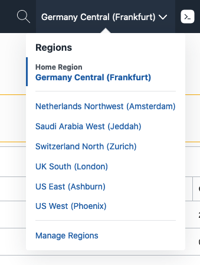
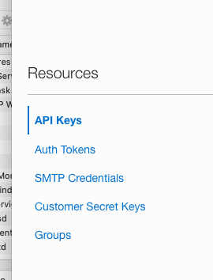

# Getting the docker login details

The following instructions cover how to get the details to intract with the Oracle Cloud Infrastructure Registry. They tell you how to get the following bits of information

- Oracle Cloud Infrastructure Registry id
- Tenancy name
- Username
- Authentication Token
- Repository name

Once you have got this information please save it in a notepad or something as you will need it later.

## Determining the Oracle Cloud Infrastructure Registry (OCIR) id

The OCIR id is based on the IATA code for the city hosting the region, for example Frankfurt has an IATA core of `fra` and Amsterdam is `ams`. Unfortunately some cities (e.g. London) have multiple airports, in others the IATA airport code refers to an old name for the city, or the airport itself is not directly named after the city it serves, so we need to look the right code up based on our region.

To determine your region look at the top of your Oracle Cloud GUI in the web browser and you'll see your current region.

If you click on the name you'll get a list of regions enabled for your tenancy and your home region

You can see here in this example we're using the Frankfurt region, which is also our home region. While you can use any region that's enabled for your tenancy for the purposed of this lab we recommend you use your home region.

Now go to the [OCIR Availability By Region list.](https://docs.cloud.oracle.com/en-us/iaas/Content/Registry/Concepts/registryprerequisites.htm#Availab)

Locate your region on the list and then to the right identify the region id, for example we can see below in the case of Sydney the OCIR id is `syd.ocir.io`

Note that if your region is **not** on the list then you will need to chose one from your regions list list that is. If none of the regions in your list have OCIR availability then click the Manage Regions button to add a region that is on the [OCIR Availability By Region list.](https://docs.cloud.oracle.com/en-us/iaas/Content/Registry/Concepts/registryprerequisites.htm#Availab)

## Determining your tenancy and username

In the upper right of the Oracle Cloud web GUI there is a shadow of a person  

If you click it you will see a detail of the tenancy

Here we can see the user is `username` and the tenancy is `oractdemeabdmnative`, details differ based on the tenancy of course.

It is highly likely that the username will be the email address you used

## Getting your Authentication Token

OCIR uses an authentication token rather than a password. To set an authentication token you need to take the following steps. Please be aware that the token is only shown once, if you don't save it at that point you'll have to create a new one.

- Click the user shadow on the upper right 

You will see the users details

- Click the user info - in this case it's oracleidentitycloudservice/username
You will be taken to your user page
- Scroll the page down until you  see the Resources options

 - Click on the `Auth Tokens`
 The section immediately to the right of the resource menu will update to display the Auth Tokens options
 - Click the `Generate Token` button, in the popup give it a name, doesn't matter what, in the example below I chose `MyToken`
 
 - Click the `Generate Token` button, the system will generate a token for you
  
 
 Note that the token is only displayed if you click `show` but the best option it to click `Copy` to copy the token to your computers clipboard. From there paste it into a file of text editor or something. The pasted token will look to be a set of random characters, for example `q)u70[]eUkM1u}zu;:[L` (of course yours will be different)
 
 **BEFORE YOU CLOSE THE GENERATE TOKEN POPUP MAKE SURE YOU HAVE SAVED THE TOKEN SOMEWHERE SAFE** The token *cannot* be retrieved after you close this screen, the only option os to destroy it and create a new one

## Chosing the repo name 

You now need to chose a name for your repository,this is a combination of the OCIR regirtsy and tenancy you determined above and a repo name you chose. An OCIR repo name looks like <OCIR Id>/<tenancy>/<repo_name>

- Chose something unique **TO YOU** e.g. your initials : tg_repo 
- this must be in **lower case** and can **only contain letters, numbers, underscore and hyphen**

The ultimate full repository name will look something like `fra.ocir.io/oractdemeabdmnative/tg_repo` (yours will of course differ)

**Please save the information you gathered in a text file or similar, some of it can only be retrieved once**

If you had forgotten the token and decide to regenerate it then you will need to re-do any steps that involved it, including docker logins and also setting any Kubernetes secrets.