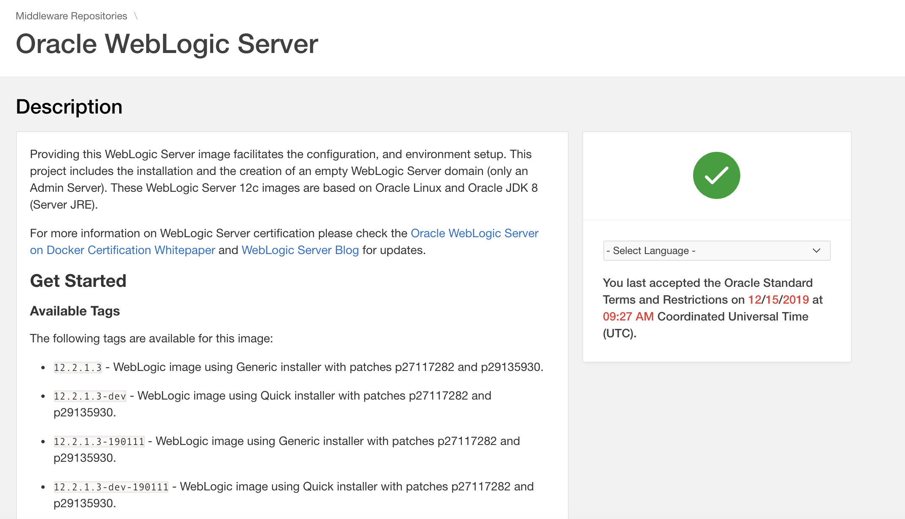
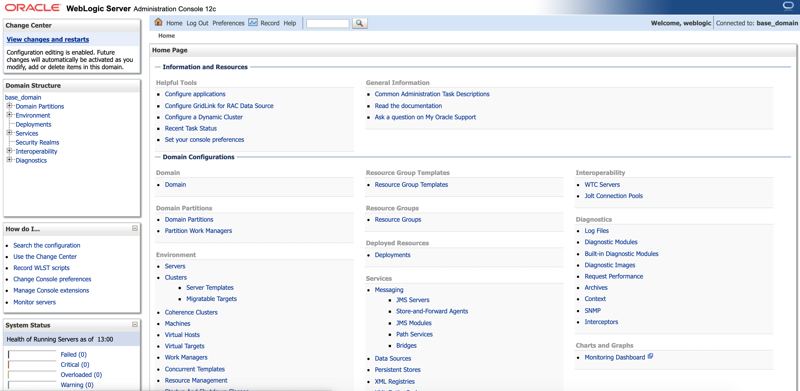
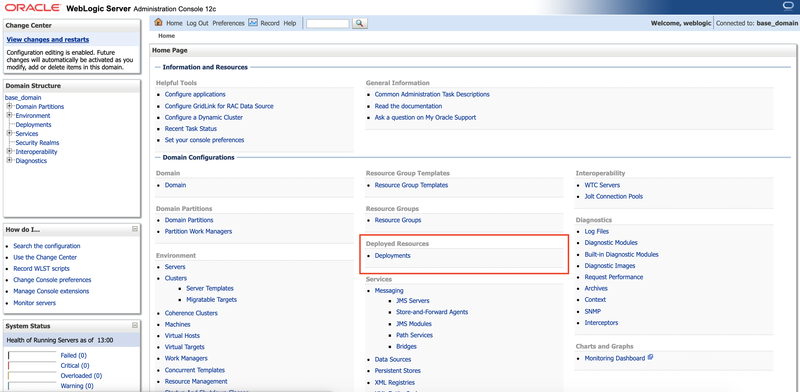
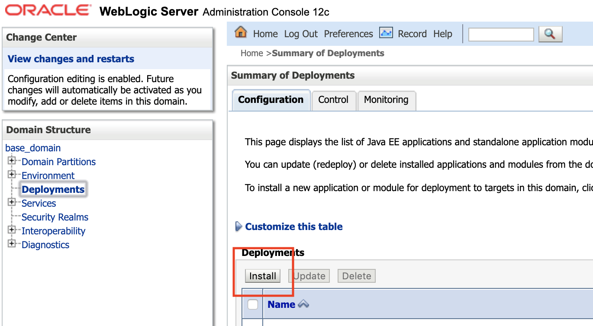
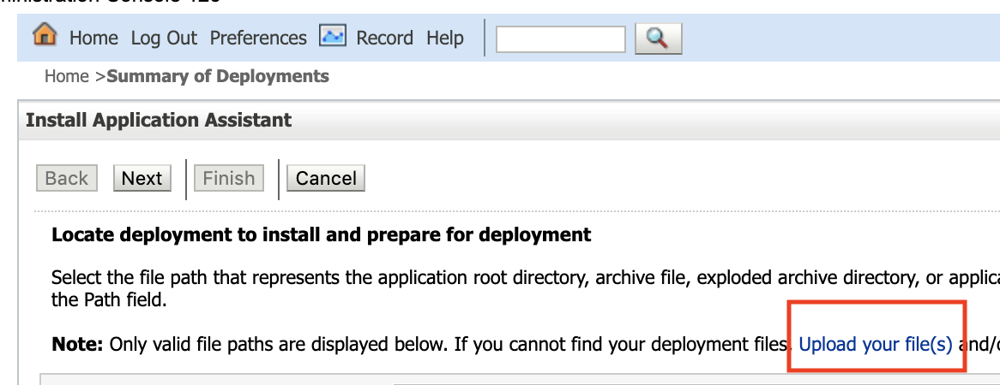
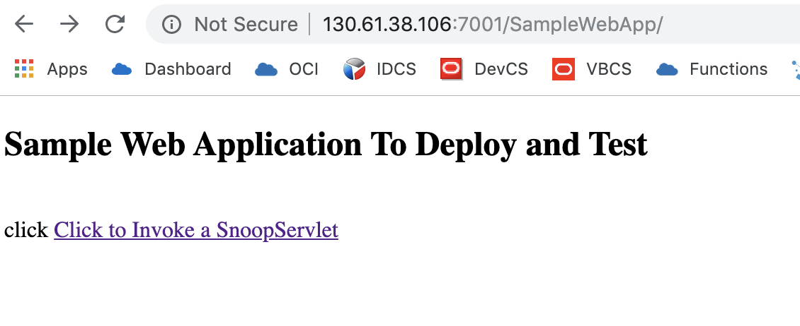

[Go to the Cloud Test Drive Welcomer Page](../../readme.md)


# Running WebLogic on Docker

## Introduction

This lab will showcase the use of the Oracle provided WebLogic Docker image to spin up an instance of a WebLogic server on a local machine.  Via the WebLogic management console you will install a demo app, and validate it is working correctly via a browser. 

### Prerequisites

To run this lab, you need following elements : 

- An Oracle account to download the docker image.  To create an account, follow instructions [here](https://profile.oracle.com/myprofile/account/create-account.jspx)
- docker software installed on your machine
  - If you are following this lab as part of an Oracle physical event, your instructor might provide you with a Linux Virtual machine, in which case you can simply access the desktop of that environment via a VNC viewer.  Docker will already be running on that environment.
  - Install instructions for docker can be found [here](https://www.docker.com/products/docker-desktop)

### Downloading the WebLogic Docker image:

- Navigate to the Oracle Container Registry
  
- https://container-registry.oracle.com/
  
- Choose **Middleware**, and then **WebLogic**

- You need to sign into the Oracle website to accept the License agreement.

  - Click on **Sign In**
  - Accept the T&C

  

  

- Start the docker software on your machine

  - On a laptop, launch the **Docker Desktop** application
  - Users of a Linux Virtual machine : docker will already be running

- Open a new console window, and perform following operations:

  - Login to the oracle docker registry with your Oracle credentials (username / password)

    ```
    docker login container-registry.oracle.com
    ```

  - Now pull down the image :

    ```
    docker pull store/oracle/weblogic:12.2.1.3-dev-190111
    ```

- After the download has finished, you can do following command to validate the image is available:

  ```
  docker images
  
  REPOSITORY                                          TAG                   IMAGE ID            CREATED             SIZE
  container-registry.oracle.com/middleware/weblogic   12.2.1.3-dev-190111   7cbc48edced8        6 months ago        970MB
  
  ```

  

### Starting up a WebLogic container

- Create a local file called **domain.properties** with following content :

```
username=weblogic
password=welcome1
```

- Run the container : 

```
docker run -d -p 7001:7001 -p 9002:9002 \
  -v $PWD:/u01/oracle/properties container-registry.oracle.com/middleware/weblogic:12.2.1.3-dev-190111
```

- Validate the WLS domain is running by connecting to the admin console : 
  
  https://localhost:9002/console/

  - You will have to ackowledge a security exception
  - Wait for the admin console to start, and log in with the username / password you specified in the domain.properties file.
  
  You should now be on the WebLogic Admin console 




### Run a Sample application

Now let's deploy a very simple sample app.

- Download the war file from [this location](https://github.com/AKSarav/SampleWebApp/raw/master/dist/SampleWebApp.war)

  -  : https://github.com/AKSarav/SampleWebApp/raw/master/dist/SampleWebApp.war.  See [this link](https://www.middlewareinventory.com/blog/sample-web-application-war-file-download/) for more info on this application.

- In the WLS console, navigate to "Deployments"

  

  

- Click "Install"

  

  

  - Use the "Upload your file" link in the "Note" text to upload the war file you downloaded before

    

  - Hit Next, choose the default 'Install as application" option, then Finish

  - Check parameters in the "Testing" tab, you should see your app deployed on 7001/SampleWebApp

- Now access the app in your browser : http://localhost:7001/SampleWebApp/



Other samples can be found here : https://github.com/oracle/docker-images/tree/master/OracleWebLogic/samples


---

[Go to the Cloud Test Drive Welcomer Page](../../readme.md)