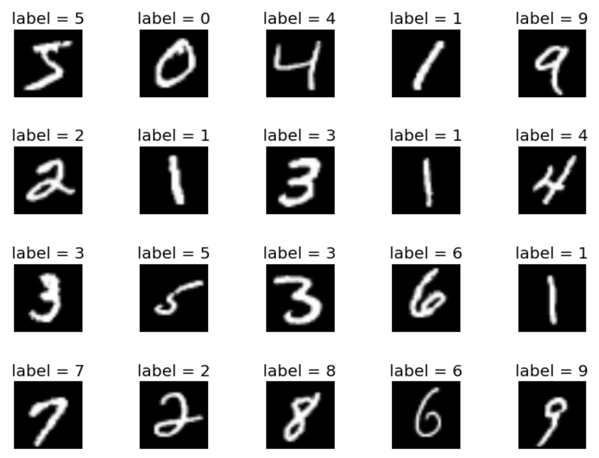
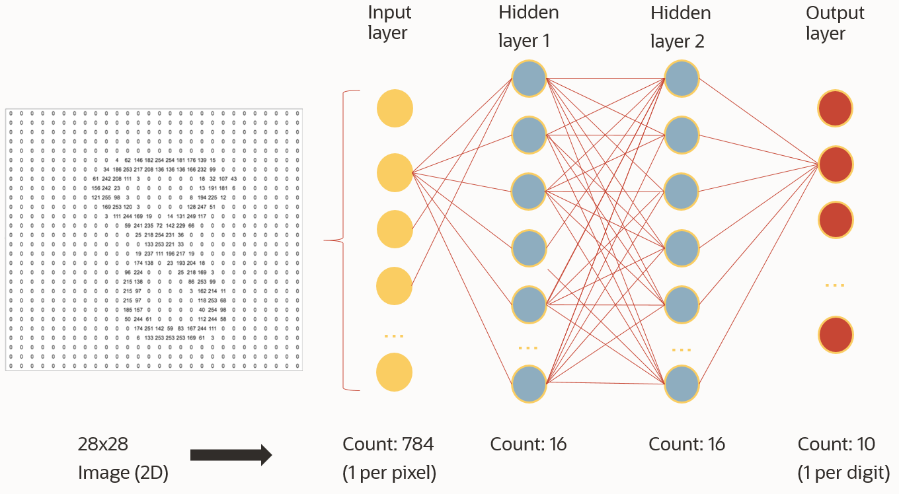
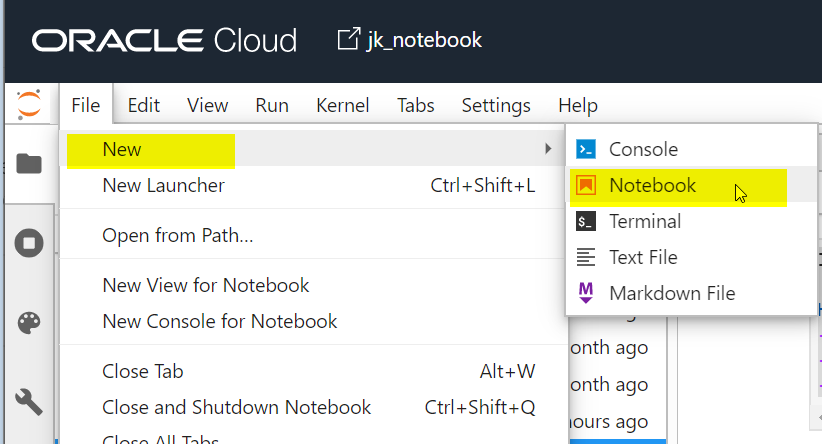

# Lab: Recognize handwritten digits using Neural Networks

In this lab we will build a Neural Network to recognize handwritten digits. In a second step we'll try to improve its accuracy by upgrading it to a Convolutional Neural Network.

## Objectives
- Become familiar with Neural Networks.
- Become familiar with Convolutional Neural Networks.

# Prerequisites

You require the following:
- An Oracle Cloud tenancy
- A Data Science project + notebook. Please follow these [instructions](../prereq1/lab.md) first in case you don't have this yet.
- We assume that you're familiar with basic ML concepts of data exploration, preparation, training/evaluating, et cetera. If not, you may want to do the [previous lab on Linear Regression](../lab100/lab.md) first.

### The dataset

We will use the MNIST (Modified National Institute of Standards and Technology database) dataset for this, a real classic in Machine Learning. This dataset consists of thousands of images, each image representing a handwritten digit. All images have been labelled with the corresponding digit.


### Neural network architecture

Have a look at the architecture that we will build. 
- Input layer: Our NN must be able to process one image in its input layer at a time. As you know, an image is 2D (in our case 28x28 pixels), but a basic NN input layer is flat (1D). Therefore, we will convert the 2D image into a long 1D array (28*28=784 input neurons).
- We will have 2 hidden layers of 16 neurons each. The number of hidden layers and the number of neurons are somewhat arbitrary, and you may want to experiment with these.
- Output layer: This will have 10 neurons. Each neuron will represent the output for one of the digits (0 to 9).


### Install additional Python library idx2numpy

  - In this lab we will require a Python library that by default is not installed in Data Science, called "idx2numpy". 
    The source images are in IDX format, but we need a native array format for our Neural Network.
    This library takes care of the conversion from IDX to native array format.
    
  - Create a terminal. This is basically your OS access. 
          
  
  - Install the new library. PIP is a command line tool to install Python packages. Copy the following command into the terminal.
  
```
pip install idx2numpy
```

          

# Data Access and Exploration

  - Create a new Jupyter notebook.
   
  

Download the MNIST data as follows:
```
!wget http://yann.lecun.com/exdb/mnist/train-images-idx3-ubyte.gz
!wget http://yann.lecun.com/exdb/mnist/train-labels-idx1-ubyte.gz
!wget http://yann.lecun.com/exdb/mnist/t10k-images-idx3-ubyte.gz
!wget http://yann.lecun.com/exdb/mnist/t10k-labels-idx1-ubyte.gz
```

- **Everytime you see a piece of code as above, please paste it into the notebook and click the run icon.**
  
  
  
  This should execute without errors.
  
```
!gunzip train-images-idx3-ubyte.gz
!gunzip train-labels-idx1-ubyte.gz
!gunzip t10k-images-idx3-ubyte.gz
!gunzip t10k-labels-idx1-ubyte.gz
```

  Note that all the files should be available in your root folder in the Data Science notebook.

- Now, let's load the data into memory
```
%matplotlib inline
import idx2numpy
import numpy as np
trainfile = 'train-images-idx3-ubyte'
trainfilelabels = 'train-labels-idx1-ubyte'
testfile = 't10k-images-idx3-ubyte'
testfilelabels = 't10k-labels-idx1-ubyte'
x_train = idx2numpy.convert_from_file(trainfile)
y_train = idx2numpy.convert_from_file(trainfilelabels)
x_test = idx2numpy.convert_from_file(testfile)
y_test = idx2numpy.convert_from_file(testfilelabels)
```
  In the previous lab we had to split the data into train and test ourselves. Notice that in this lab the split has already been done for us.
  x_train are the images. You could see every pixel as an input feature.
  y_train are the labels of the image. This is a one-dimensional array with the digits as assigned by a person (0 to 9).
  Equally, x_train and y_train are the images and corresponding labels for the test set.  


- How many images do we have for training, and what is the size of each image?
```
x_train.shape
```
  The training data set has 60000 images. The other values indicate the dimensions of the image: 28x28 pixels.


- And what is the shape of the labels for training? 
```
y_train.shape
```
  This is simply a list of 60000 entries. Each entry indicates the digit for the image (a value from 0 to 9).
  
  
- Let's do the same for the test images.
```
x_test.shape
```
  There are 10000 images for validation.
  
  
- And let's doublecheck the labels of the test images.
```
y_test.shape
```
  And indeed, these are also labeled with the corresponding digit.


- How does one particular image actually look like? Let's display one of the training images at random, in this case the one with index 5 (of 60000).
```
x_train[5]
```

  You can more or less see a shape of a digit show up. We'll show it as an actual image a bit later on.
  **Notice also how the values of each pixel are between 0 and 255, this indicates the grayscale of each pixel.**


- What is the label for this particular image? Let's show the label by accessing the y_train with the same index (5).
```
y_train[5]
```

  According to the labels, this is an image of the digit 2.

  
- Let's verify this by displaying the data as an image. We will use the matplotlib library to do so.

```
import matplotlib.pyplot as plt
plt.imshow(x_train[5], cmap='Greys')
```
  
  Indeed, we can see that this is a two.
  
# Data Preparation

The Neural Network that we want to build will have an input layer of 784 neurons. See also the architecture picture above. Each of the neurons will represent one pixel in the input image.
There are two issues that we have to address:
1) The shape: We must convert the 2D shape of 28x28 pixels into a 1D array of 784 elements. 
2) The values: Our input neurons expect values between 0.0 and 1.0, however our actual input values are currently 0 to 255. We must convert these values as well.

- Flatten the 28x28 array of each image into a 784 array. Do this for train and test.

```
x_train = x_train.reshape(x_train.shape[0], 784)
x_test = x_test.reshape(x_test.shape[0], 784)
```

- Let's check that this conversion was successful by checking the new shape of the training set.
```
x_train.shape
```


- Now, convert the values of the pixels from 0-255 to 0.0-1.0.
```
x_train = x_train.astype('float32')
x_test = x_test.astype('float32')
x_train /= 255
x_test /= 255
```

- Let's check the result by again displaying our example digit at index 5.
```
x_train[5]
```

  You now see that there are no rows anymore in the array (it's 1D now), and that the values are between 0.0 and 1.0.


# Model training

Let's doublecheck the shapes of the input data before we start the training process.
```
print('x_train shape:', x_train.shape)
print('Number of images in x_train', x_train.shape[0])
print('Number of images in x_test', x_test.shape[0])
```

  You should see x_train shape: (60000, 784), Number of images in x_train 60000, Number of images in x_test 10000.
  

- Our data is ready to go. Now it's time to build the neural network. Remember, we will build an input layer of 784 neurons, then two hidden layers of 16 neurons each, and finally an output layer of 10 neurons (one for each digit). If this is unclear, please review the architecture at the start of the lab.
  We are using the Tensorflow and Keras open source libraries for this.

```
import tensorflow as tf
from keras.models import Sequential
from keras.layers import Dense
model = Sequential()
model.add(Dense(16, input_shape=(784, ), activation=tf.nn.relu))
model.add(Dense(16, activation=tf.nn.relu))
model.add(Dense(10, activation=tf.nn.softmax))
```

  Notice how in the first model.add we have to specify both the input shape (784 neurons) and the first hidden layer (16 neurons). 

- At this point the "template" of our Neural Network is ready. It has random weights to start with. Next, we will train the model to optimize the weights.

```
model.compile(optimizer='adam', 
              loss='sparse_categorical_crossentropy', 
              metrics=['accuracy'])
model.fit(x=x_train, y=y_train, epochs=10)
```

  Notice that the input for the model training are the training images (x_train) and the training labels (y_train).
  We have chosen 10 epochs. This means that all images will be fed and backpropagated 10 times.
  In addition there are a number of other parameters that we will not go into here. 

  If you installed your Notebook on shape VM.Standard.E2.2, the training process will take about 2 minutes.
  
# Model evaluation

- Check the accuracy of the last epoch.
          

  You should see an accuracy of around 96%. This is the accuracy on the data in the **training** set. However, as you know by now, it's important to verify the accuracy of the model on -unseen- data.

## Visual verification on the test set

- First of all, let's check the performance intuitively through a visualization. Let's take an example image from the testset and check if the model is able to classify it correctly. We'll take a random index of 99.

```
plt.imshow(x_test[99].reshape(28, 28),cmap='Greys')
```

  As you can see, this is a 9.
  
- What is the official label for this digit?

```
y_test[99]
```
    
  As you can see, it's been labelled as a 9 as well.
  
- Is our model able to correctly classify it as a 9?

```
predict = model.predict(x_test[99].reshape(1,784))
print(predict.argmax())
```

  The argmax function returns the output neuron that has the highest value. In this case this correctly predicts a 9.
  
## Numerical verification of the model

- We can use model.evaluate to calculate the accuracy of prediction on the entire testset.
  This will do two things: 1) Run the prediction on the 10000 images in the testset 2) Compare the predicted digits with the actual labels, and calculate an accuracy.
  
```
model.evaluate(x_test, y_test)
```
  You should see an accuracy on unseen data of about 95%. 
          
  
  This is the actual accuracy of the model. In other words, the model is able to interpret an image of a digit and correctly classify it in 95% of the cases.


<!--# Bonus Exercise (optional)
.......-->


# Conclusion
  - You have made your first steps with Neural Networks.
  - You have learned how to typically prepare data for a NN.
  - You have learned the basics of constructing a Neural Network with Keras and Tensorflow.
  - You have learned how to visualize images with the matlib library.
  
  - And, hopefully, you have been inspired to apply Neural Networks to many more situations!

# Follow-up questions


[lyudmil.x.pelov@oracle.com](mailto:lyudmil.x.pelov@oracle.com)


[jeroen.kloosterman@oracle.com](mailto:jeroen.kloosterman@oracle.com)
