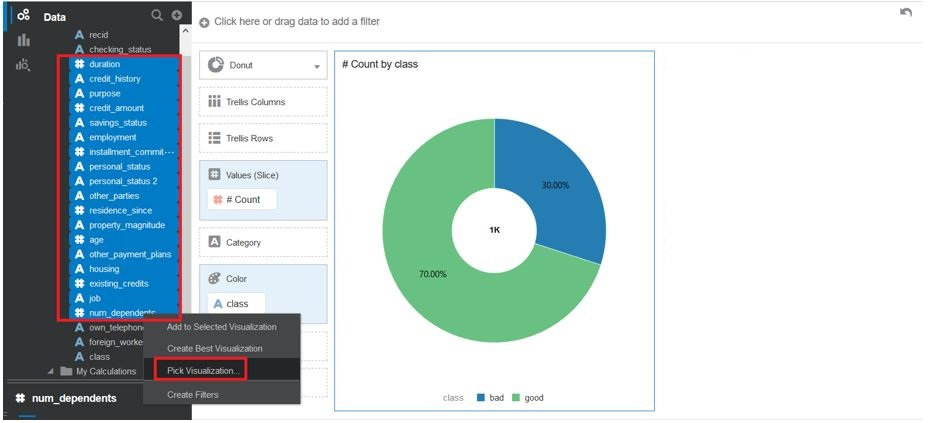
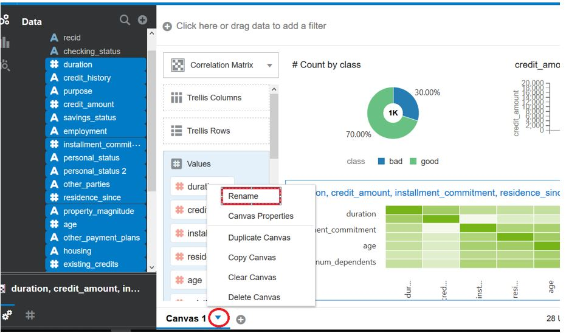
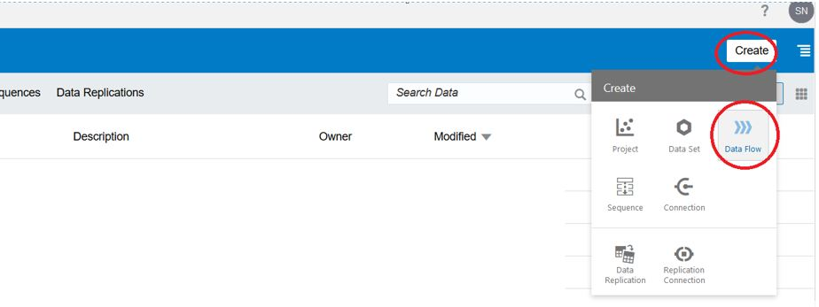
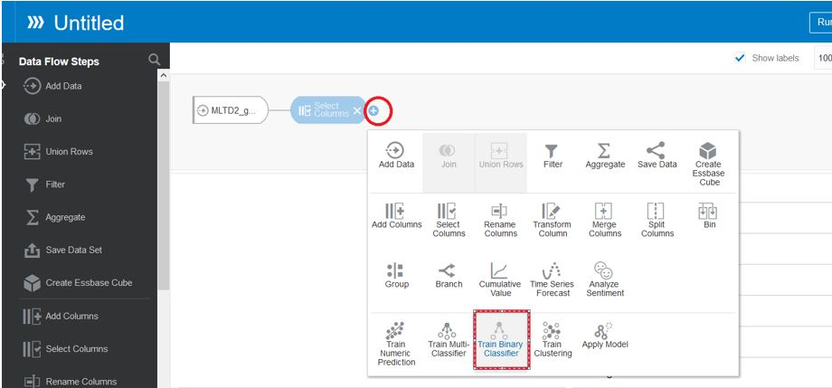
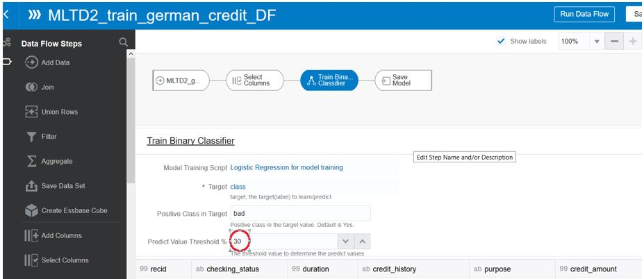
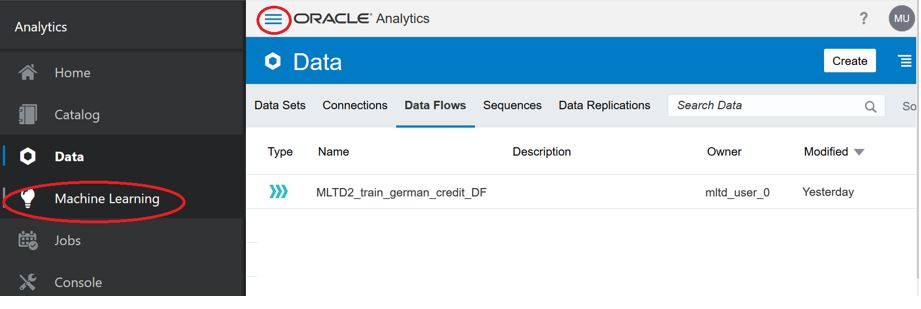
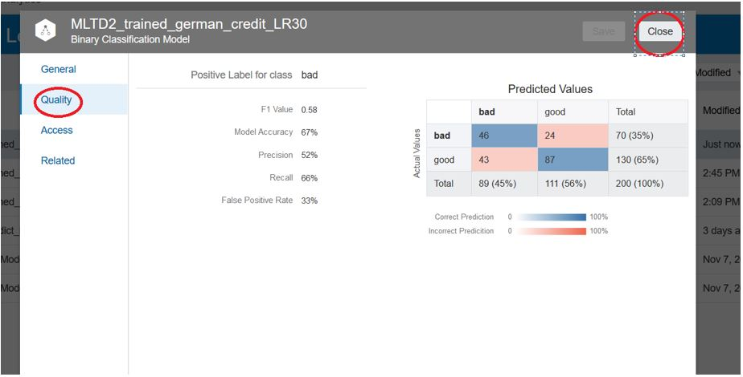
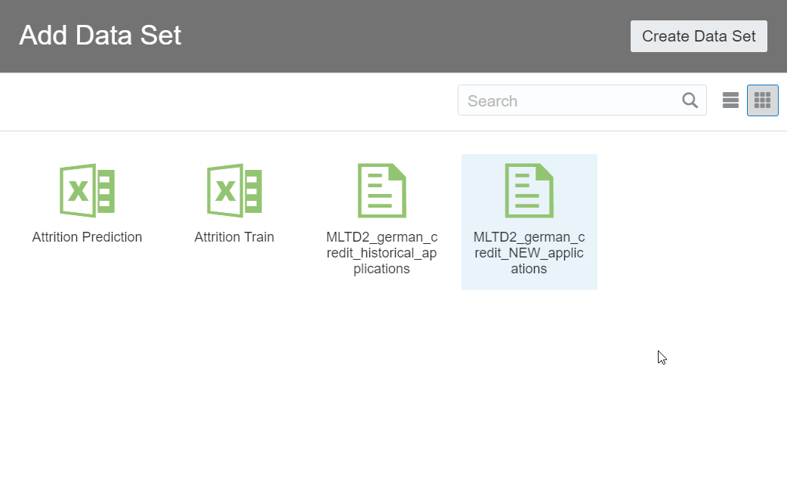
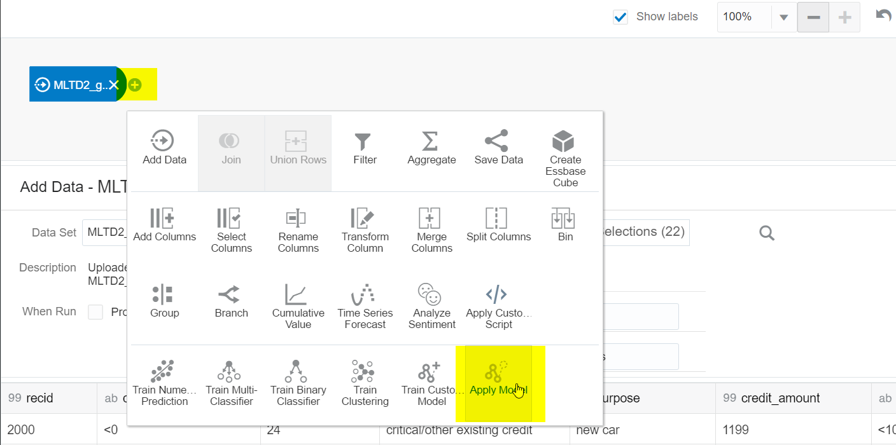

# Lab: Assessing Credit Risk using Oracle Analytics

In this lab we will take the perspective of a **business user** (as opposed to the expert data scientist). 
Oracle Analytics lets business users build and apply ML models in a very visual and intuitive way. Oracle Analytics provides algorithms in all major ML categories, e.g. Regression, Classification, Clustering and Association Rule Mining.
In addition, there's a set of featured called "Augmented analytics" in this platform that uses ML "under the hood" to automate a lot of the common tasks in the analytics process, think about Data Preparation and Data Exploration.

## Objectives
- Become familiar with Oracle Analytics and self service analysis. 
- See how Oracle Analytics can be used to do Data Preparation and Exploration in a -visual- way, as an alternative to coding.
- Understand the impact of ML in the hands of business users.

# Prerequisites

You require the following: 
- An Oracle Cloud tenancy
- Either an Oracle Analytics Cloud instance **or** a local installation of Oracle Analytics Desktop. 

Please follow the [prerequisites](../prereq3/lab.md) first in case you don't have these yet.

# Data Preparation

First we have to upload the data that's required for our model. In this case, the dataset with historical credit assessments is mostly ready to go, without requiring any changes.

- Download the [training dataset](./data/MLTD2_german_credit_applications.csv) with historical credit information.

Click on the link, then use the "Raw" button and then right click "Save As". Make sure to save these with extension CSV. Some browsers try to convert this to Excel format, which is incorrect.

The original dataset contains 1000 entries with 20 categorical and numerical attributes prepared by Professor Hofmann and each entry in the dataset represents a PERSON who took a credit and classified as good or bad credit risk.
The dataset provided to you as part of the material was obtained from the following location: https://archive.ics.uci.edu/ml/datasets/Statlog+(German+Credit+Data)
We will try to capture the knowledge that this person applies to assessing credits in a ML model.

The first task to do is to upload the MLTD2_german_credit_applicants.csv dataset provided to you into Oracle Analytics Cloud. You can find it [here](./data/MLTD2_german_credit_applicants.csv). 

- Open Oracle Analytics Desktop (or Oracle Analytics Cloud, if you prefer). On the top left corner click on the menu icon and Click on "Data".

- To import the dataset click on "Create", "Data Set", and select the file that you downloaded earlier.

- You see a preview of the dataset. Complete the process by clicking "Add"

- By default Oracle Analytics incorrectly treats the "recid" column as a measure. Change it to "Attribute" by clicking on "recid", then "treated as", then "attribute".

- Oracle Analytics records all changes you make in a script. This allows it to easily repeat the process in case data is reloaded. For now, apply the script that has been created by clicking "Apply Script". This makes the change to recid effective.

# Data Exploration

As you know, this phase in the Data Science process is for us to get to know our data, identify which columns are useful, detect any problems with the data, et cetera.

First of all, let's imagine you want to know how many credit applications have been Accepted vs Denied in the past. We can use Oracle Analytics' visualization capabilities for this.

- Create a project in order to investigate the dataset using visualizations by clicking on the burger menu associated with our dataset and "Select Project".

- First we need a way to count the credit card applications. We do this as follows: Right-click on ‘My calculation’ folder of the dataset and select "Add Calculation".

- The name of the field can be anything, e.g. "# Count". Then add a counter by Double-clicking on ‘Count’ in the ‘Aggregation’ list of options. 

- Define the counter by selecting the column "recid", then click "Save".

- Now we can find an answer to our questions. Select both the "class" and the "# Count" fields (use Control to select multiple fields). Then ‘Right-Click’ on the blue part and select "Pick Visualization". 

- Select the ‘donut’ visualization

- You see that 70% out of 1000 credit applications were good and 30% were bad for the target called ‘class’

- Now let's say we have a NEW question. We'd like to know how the Credit Amount that's requested is related to to a Good or Bad credit scoring. Again, we can create a visualization to answer that question. This time, select the field "Recid", "Credit_amount" and "Class" and choose the "Boxplot" Visualization.

- Now, you see ‘Boxplot Visualization’. You can the bulk of applications in terms Credit_amount for class=good and class=bad
It shows the bulk of credit_amounts for good and bad credit, the amount which are not in the bulk. My conclusion is that the range of credit_amount for bad credit is bigger than for good credit, although the average value seems the same.

- Remember the colinearity issue from the previous labs? Colinearity is the effect of multiple attributes that supply similar information. When we train our model, we should try to only supply attributes that provide unique pieces of information. To investigate this issue, we will create a correlation diagram between the input features. Do this by selecting all the fields from "duration" until "num_dependants". Choose "Pick Visualization" and select "Correlation Matrix".

- Now you see the correlation matrix visualization. Although there is some correlation between the fields, the correlation does not appear to be too high in any place. Therefore there's no colinearity and no action to be taken. 

- Save the results of the Data Exploration. Give it a logical name.

At the is point you are doing with the investigation of the dataset and move on the next task

# Train the model

Our goal is to build a model that can correctly assess the credit of an application for a loan with either "Good" or "Bad".
In Oracle Analytics, this is done by creating a so-called "Data Flow". A "Data Flow" specifies the source of the data for the training, any data transformations, and a step for the actual model training.

- Create a new Data Flow by going to the "Data" menu, then select "Create" and "Data Flow".

- Every Data Flow starts with a dataset. Select the dataset that we uploaded earlier (‘MLTD2_german_credit_applicants’) and select "Add".

- During Data Exploration we found that we want to keep all attributes for training. However, the identifier "recid" does not have any values, so let's remove it.  Use "remove selected" next to this column to remove it.

- In this case we need a Binary Classifier algorithm. The reason is that our output are two possible classes: "Good" and "Bad". Add a "Train Binary Classifier" step at the end of the process (see "+" symbol").

- There are different algorithms available to do binary classification. In this case we will select "Logistic Regression for model training".

- There are a few hyperparameters for this algorithm. Most importantly, we have to select what the target column is. In this case, select "class". "class" is the column that was set by the credit assessment expert historically. The other hyperparameters are "Positive Class in Target", set this to "Bad", this means that for us it's important to predict "bad" credit. Set the value for "Predict Value Threshold Value" to 30%. Set "Standardization" to True.

- You see that a "Save Model" node was automatically created. Click it and set ""MLTD2_trained_german_credit_LR30" as the model name.

- Now, save the Data Flow. Click on ‘Save’ and choose "MLTD2_train_german_credit_DF".

- Next, we can finally execute the Data Flow. Effectively this will train the model. Click on "Run Data Flow" (top right). This could take up to 10 minutes, depending on the speed of your PC. A message will appear saying that the data flow was run successfully.

# Evaluate the model

Now that you have built the model, you need to assess how good it is and decide if you are happy with it. Oracle Analytics Cloud machine learning provides quality metrics to allow you to evaluate how good the trained models are. 

- First, locate the trained machine model by going to the "Machine Learning" menu and selecting our model. Then select "Inspect".

- Go to "Quality" tab to see the quality metrics associated with your model. You can see that the model doesn't predict all cases correctly. You can play with the hyperparameters to improve these results and find the best trade off for your case.

# Make Predictions (Apply the model)

We have a file with new credit applications that we would like to assess. Instead of doing this the manual (HUMAN) way, we'll use our freshly trained model.

- Download the new applications [here](./data/MLTD2_german_credit_NEW_applications.csv). Click on the link, then use the "Raw" button and then right click "Save As". Make sure to save these with extension CSV. Some browsers try to convert this to Excel format, which is incorrect.

- Again, create a new dataset, and set the "Treat As" for attribute "recid" to "attribute". The dataset should be named "MLTD2_german_credit_NEW_applications".

- You'll notice that this dataset does -not- have the class column yet. In fact, that is what we will predict now. Create a new Data Flow to score the new dataset.

- Select the new dataset. Deselect the "recid" column, as this does not have any predicted value.

- Add a "Apply Model" step in the dataflow and select the model that we trained earlier.

- Verify the next dialog. You see that the Apply Model step will create two new columns: PredictedValue and PredictionConfidence. You also see that the columns of our NEW dataset are automatically aligned with the input features of the model.

- Add a "Save Data" step. Name the new dataset "Scored New Applications"

- Save the Data Flow. Name it "Apply Credit Assessment DF".

- Run the new Data Flow. This typically takes a few minutes depending on the speed of your PC.

# View the Predictions

- Our goal is to visualize the results of the prediction. The prediction Data Flow will have created a new dataset called "Scored New Applications", as we specified. Let's create a new project on that dataset by going back to the "Data" menu, and selecting "Create Project" on this new dataset.

  
- Imagine we want to see all applications that the model has assessed with a "bad" credit scoring. We want to simply display all the results in a table. Select all columns (use Shift), then right click "Pick Visualization", and choose the Table visualization.

- Now apply a filter to only show the bad credit ratings, by dragging "Predicted Value" to the filter area and choosing "bad".

- We see that there are four applications (of the 20+ that we provided) that have been assessed as "bad".

# Conclusion

  You've seen how we can apply machine learning to perform tasks that only humans were able to do before.
  
  In addition:
  - You've become familiar with Oracle Analytics and self service analysis. 
  - You now know how Oracle Analytics can be used to do Data Preparation and Exploration in a -visual- way, as an alternative to coding.

  - And, hopefully you can see the potential impact that ML can have in the hands of business users!

# Follow-up questions

[said.nechab@oracle.com](mailto:said.nechab@oracle.com)

<!---->

[fredrick.bergstrand@oracle.com](mailto:fredrick.bergstrand@oracle.com)

<!---->

[jeroen.kloosterman@oracle.com](mailto:jeroen.kloosterman@oracle.com)
