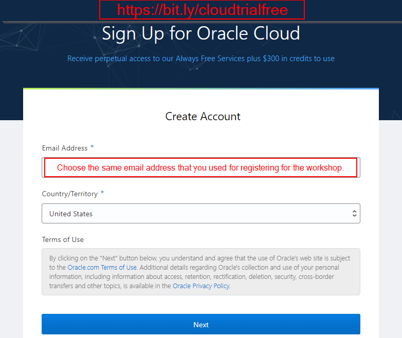
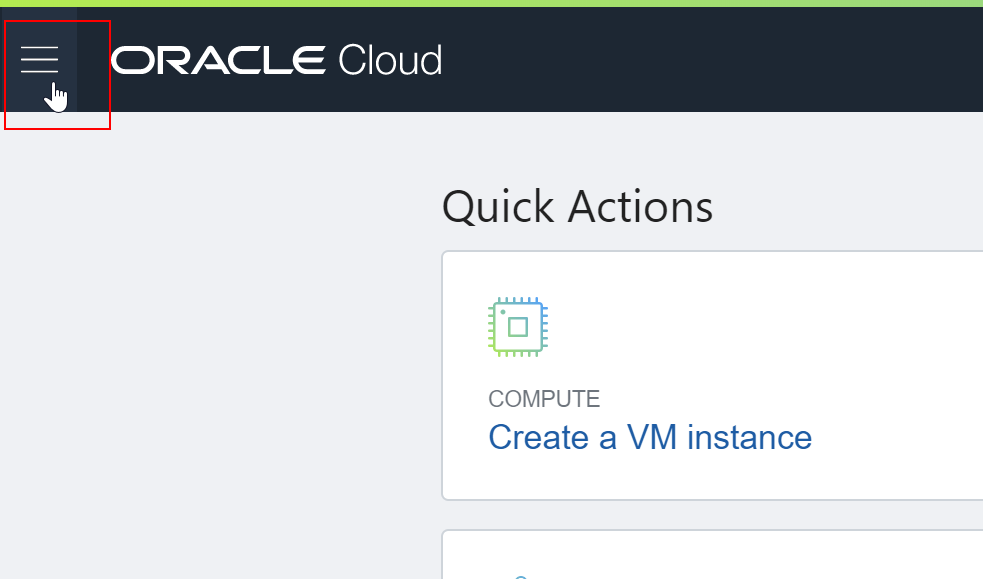
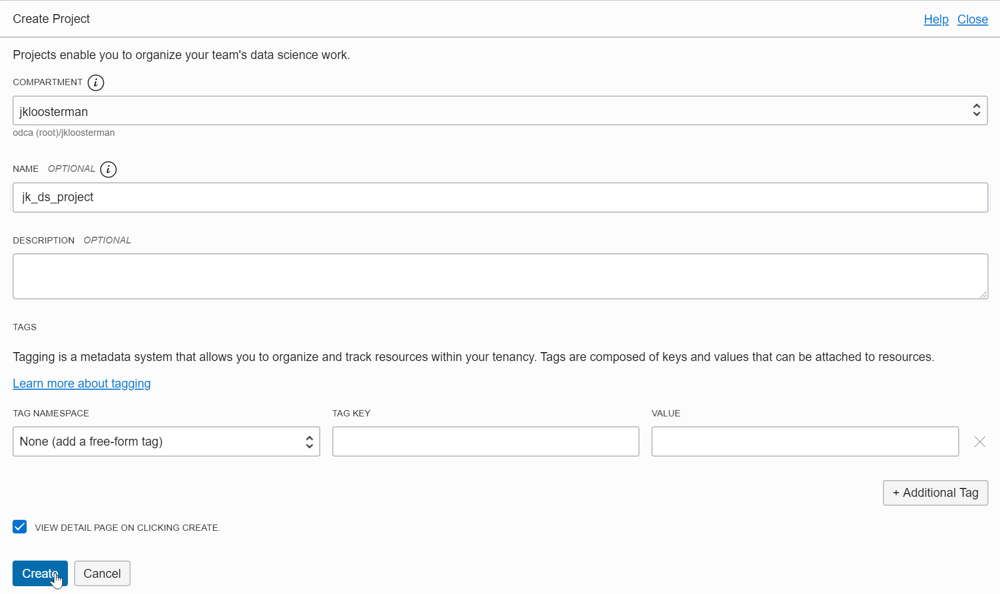
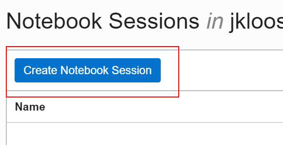

# Provision the Data Science service (Project and Notebook)

<!--
## Step 1: Request an Oracle Cloud Free Tier account
Your lab instructor will assist you to obtaining the account during the event.

To sign up for the Free Tier: [http://bit.ly/registeroraclecloud](http://bit.ly/registeroraclecloud). 




### Account Details
- On the next page you will be asked for the Cloud Account Name. This is what will uniquely identify your cloud environment. You will see it as part of the URL when you access it later.
- You will also be asked for the "Home Region". This is the location of the physical data center. Choose you nearest location.


-
- At the end of this process, you should receive an email titled "Get Started Now With Oracle Cloud".
- To login to your cloud account, use the same email address that you used for registration.
- If you have to choose your identify domain, this is the same as the value that you chose for "Cloud Account Name" during registration.
  

-->

# 1. Preparing to provision Data Science

Please follow the following document before provisioning Data Science: [Configuring your tenancy for Data Science](https://docs.cloud.oracle.com/en-us/iaas/data-science/using/configure-tenancy.htm#service-access)

Alternatively, you can follow the steps below. What follows below is a -summary- of the steps in the above document:

## Check/Set Privileges for Data Science service

Before you can use the Data Science service, you must complete these tasks to configure the service:
- Allow service datascience in tenancy
- Create or reuse Compartment
- Create VCN and Subnet or reuse 
- Create Policies to control access to network and Data Science resources

## Allow service datascience in tenancy

- Log into the Console as your tenancy administrator.
- Create a new policy in the root compartment
- Open the navigation menu.
- Under Governance and Administration, go to Identity then click Policies. 
- Add a policy statement

  ```
  allow service datascience to use virtual-network-family in tenancy
  ```

## Create compartment

- Log into the Console as your tenancy administrator.
- Open the navigation menu.
- Under Governance and Administration, go to Identity, and then click Compartments. A list of the compartments in your tenancy is displayed.
- Click Create Compartment then create a new compartment, see To create a compartment.
- Enter a meaningful name. For example, acme-network or acme-datascience-compartment. (Optional) Enter a description. Avoid entering confidential information. 

## Create the VCN and Subnets to Use with Data Science

- Log into the Console as your tenancy administrator.
- Open the navigation menu.
- From Core Infrastructure, select Networking, and then click Virtual Cloud Networks.
- If your compartment is not in the list, then refresh the browser page until it's displayed.
- Click Networking Quickstart.
- The Networking Quickstart option automatically creates the necessary private subnet with a NAT gateway.
- Use the VCN with Internet Connectivity default and click Start Workflow.
- Choose the compartment to own the network resources in the left-navigation section. 

  ```
  NOTE
  VCN Name: A meaningful name for the cloud network. For example, acme-datascience-vcn. The name doesn't have to be unique within your tenancy and it cannot be changed later through the Console. Do not enter confidential information.
    VCN CIDR BLOCK: The IP address to your VCN. For example, 10.0.0.0/16.
    PUBLIC SUBNET CIDR BLOCK: The IP address to your public subnet. For example, 10.0.0.0/24.
    PRIVATE SUBNET CIDR BLOCK: The IP address to your private subnet. For example, 10.0.1.0/24.
  ```

- Make sure that Use DNS Hostnames in this VCN is selected.
- Click Next
- Click Create to create the VCN and the related resources (three public subnets and an internet gateway).
- Select the NAT gateway you created, and then click Save Changes.

Use this VCN and its private subnet to use when you launch a notebook session.

## Create Policies to Control Access to Network and Data Science Related Resources

- Log into the Console as your tenancy administrator.
- Create a new policy in the root compartment
- Open the navigation menu.
- Under Governance and Administration, go to Identity then click Policies. 
- Add a policy statement to allow Data Science access to the network resources in a specified compartment. 

  ```
  allow service datascience to use virtual-network-family in compartment your_compartment_name
  ```

## Create a NAT gateway (necessary for Lab 200).

- In the Console, confirm you're viewing the compartment that contains the VCN that you want to add the NAT gateway to. For information about compartments and access control, see Access Control.
- Open the navigation menu. Under Core Infrastructure, go to Networking and click Virtual Cloud Networks.
- Click the VCN you're interested in.
- Under Resources, click NAT Gateways.
- Click Create NAT Gateway. choose your compartment

<!--
In summary, what the above document explains is the following:
- The group of the user must have access to manage data-science-family.
- The group of the user must have access to virtual-network-family.
- The service datascience must have access to virtual-network-family.
- The data science service must have egress access to internet (this is required for Lab 200).

**If you have any issues with these steps, please post them in Slack group #dsworkshop**.
-->

<!--Note there's a bug in the documentation: "datascience-family" is wrong, the correct "data-science-family", as below:

  ```
  allow group acme-datascientists to manage data-science-family in compartment acme-datascience-compartment
  ```
(the group and compartment names are arbitrary, and depend on your own configuration)
-->

## 2. Provisioning Data Science

- Go to the main menu.



- Go to Data Science -> Projects.


- Choose "Create Project".


- Choose a name and create the project.



- Next, within the Project, choose "Create Notebook Session".



- Choose a name. 
  For this exercise the default shape of VM.Standard.E2.2 is sufficient.
  Choose an existing VCN and subnet. If you don't have these yet, go back and create them using defaults.
  Then choose "Create".


