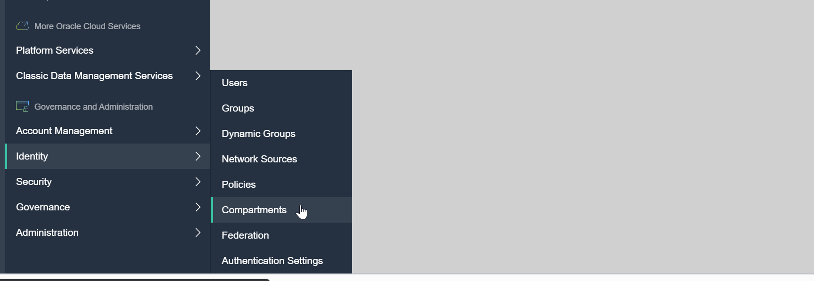
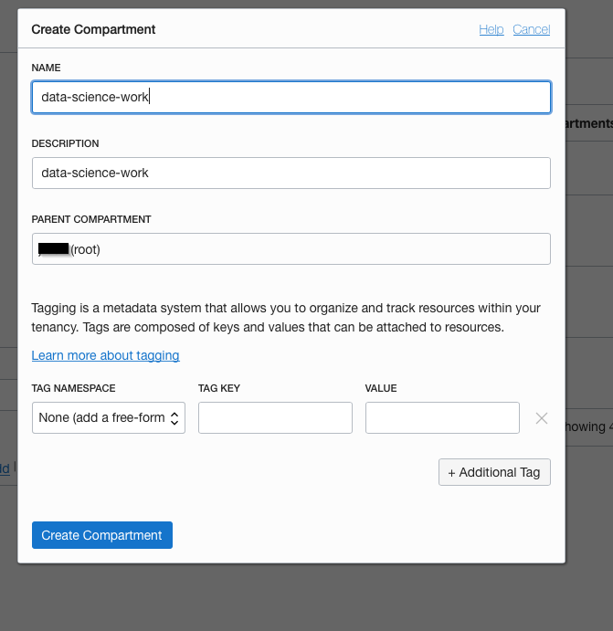
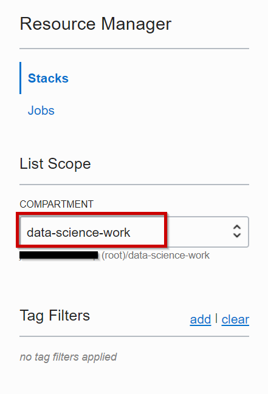
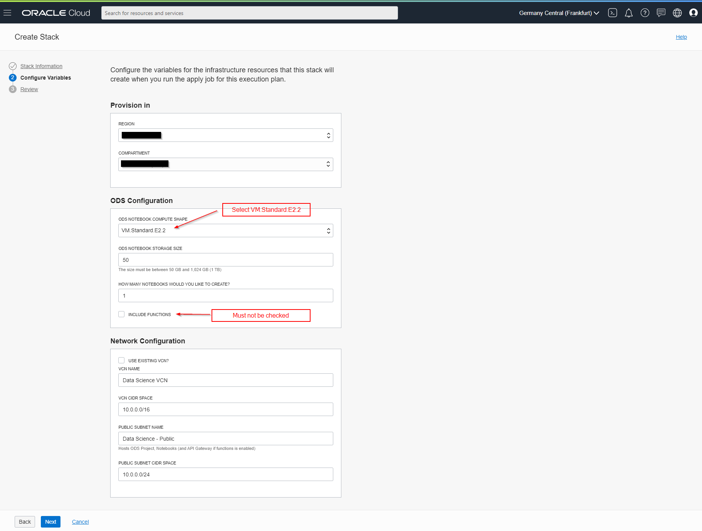
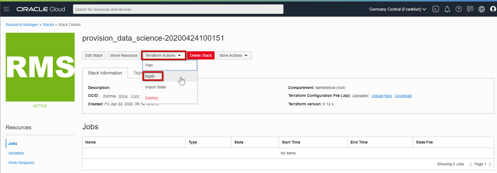
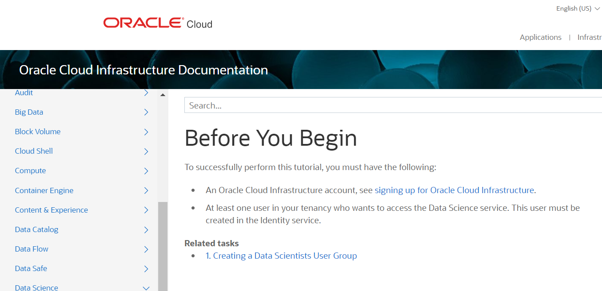

## Prerequisite 2: Provision the Data Science service and its required network resources

This consists of the following:
- Create a user group for your data scientists.
- Create a compartment for your data science work.
- Create the VCN and subnet necessary to give your data scientists egress access to the public internet from a notebook session.
- Create the proper policies to give your data scientists access to the data science service.
- Provision the Data Science service (Project and Notebook)

There are two ways to do this:
1) If you are working in an Oracle Cloud tenancy that is "empty", e.g. you have just created your Cloud Free Tier account, then we recommend you use the automated script to install the prerequisites. 

2) In case you have already provisioned several services or you have already performed configurations in your Oracle Cloud tenancy before, we recommend you provision these resources manually. In this case, follow the manual instructions so that you can control and review each step of the process as you go along and, if necessary, adapt it to your unique situation.

### Option 1: Using an automated script to provision network resources and the Data Science service

This is the recommend approach in case you are working in an Oracle Cloud tenancy that is "empty", e.g. you have just created your Cloud (Trial) tenancy. This is the fastest way to provision these resources.

- Download the script from [here](./scripts/provision_data_science.zip), save it on your local harddrive. The result should be a ZIP file.

- In your Oracle Cloud console, open the menu.

- Near the bottom of the menu, go to Identity and Administration -> Identity -> Compartments.

- Create a new subcompartment within your root compartment, name it "data-science-work".

- Open the menu again.

- Select Resource Manager -> Stacks.

- Change the compartment to "data-science-work".

- Click the "Create Stack" button.

- Upload the ZIP file (that you downloaded earlier), e.g. by dragging it over to the indicated box.

- **Important** - Change the compartment to "data-science-work". Leave the other values at their defaults and click Next.

- Now configure the variables for this stack. Again, choose the subcompartment that you created earlier.

The rest of the variables should remain the same. In particular we recommend that you keep the default compute shape VM.Standard.E2.2 as it is more than enough for the workshop, and it will allow you to use the services for longer.
Also please keep the Functions option UNchecked, we wil not be using Functions in this workshop, and it makes the configuration much easier.

<!---->

Click Next.

- The configuration you've entered is shown for verification. Click Create.

- Run the job by going to "Terraform Actions" and choosing "Apply".

- Click Apply once more to confirm the submission of the job.

Provisioning should take about 10 minutes after which the status of the Job should become "Succeeded".

### Option 2: Manual installation steps to provision network resources and the Data Science service

This approach is recommended if you already have other services / configurations made in your Oracle Cloud tenancy. 

If this is the case, please follow the detailed provisioning steps [here](https://docs.cloud.oracle.com/en-us/iaas/data-science/data-science-tutorial/tutorial/get-started.htm#concept_tpd_33q_zkb).

## Next

Continue to [Prerequisite 3: Install Oracle Analytics Desktop](../prereq3/lab.md).
